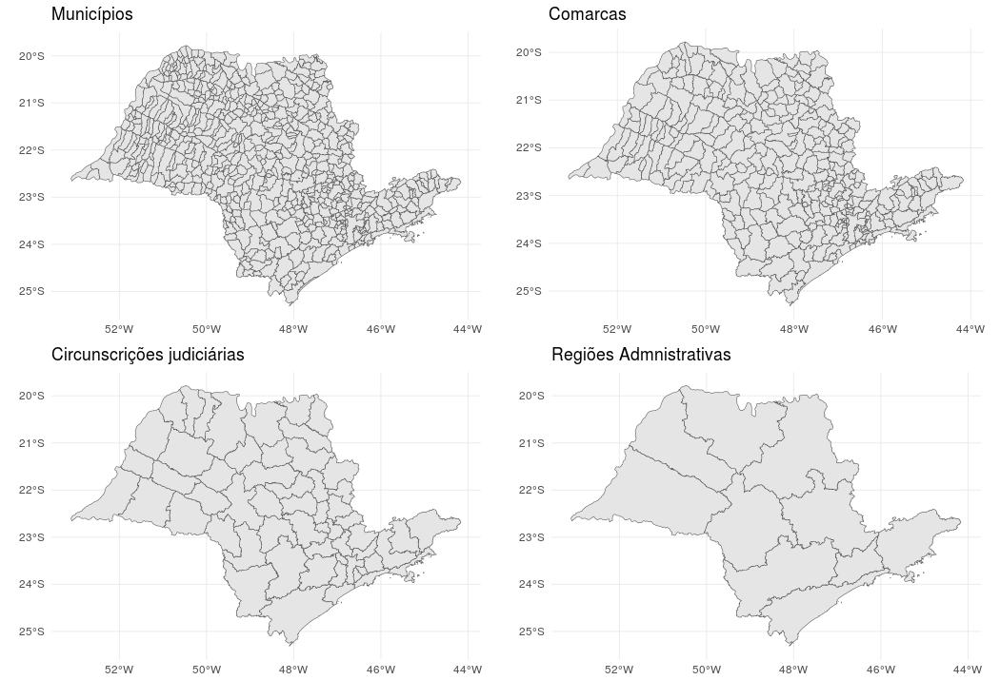
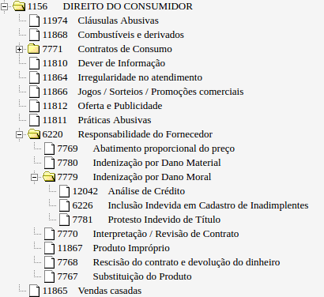
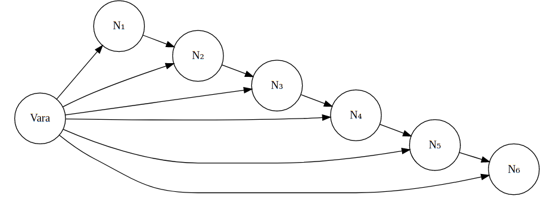
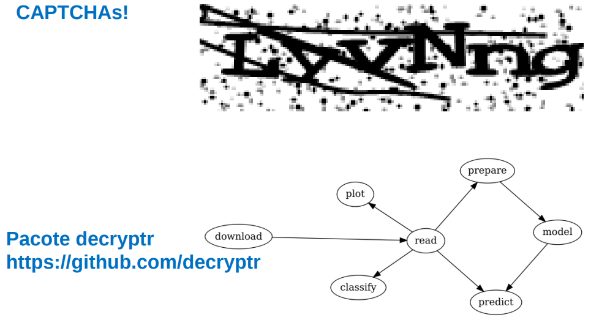
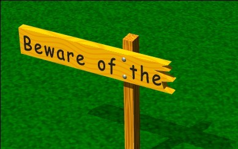
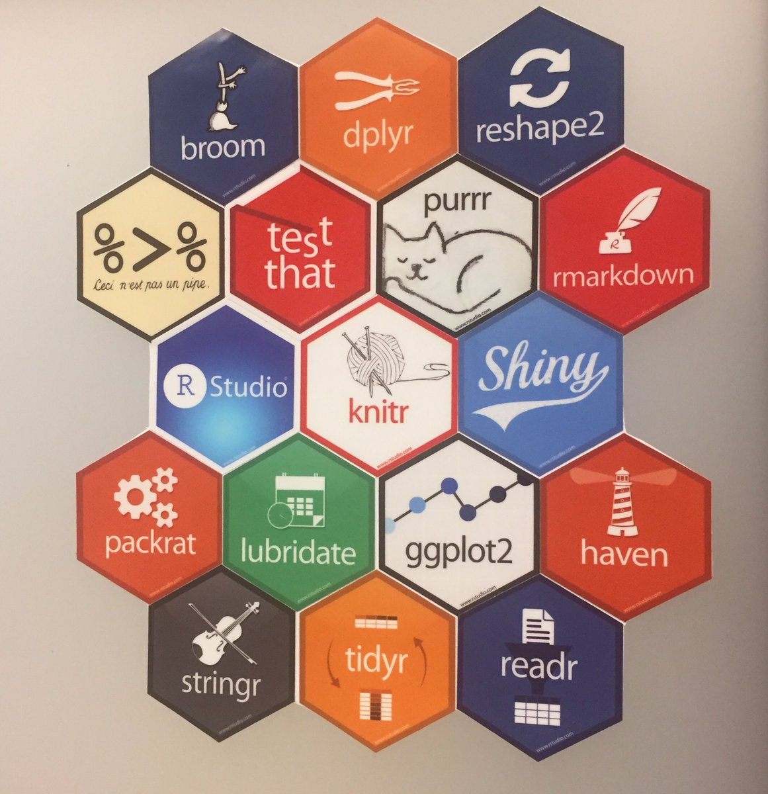

# Introdução

Bem vinda ao maravilhoso mundo da jurimetria. 

Essa é sua última chance. Está preparada?

```{r out.width="100%"}

```

## O que é Jurimetria?

A jurimetria é o estudo empírico do direito. Ela se distingue das demais disciplinas jurídicas por tratar o direito de forma concreta. 

```{r, out.width="60%", fig.align='center'}
knitr::include_graphics("imgs/empirical.png")
```

A pesquisa em jurimetria utiliza dados do judiciário para avaliar desde argumentos quantitativos a serem utilizados por juristas e advogados até o impacto de leis. No Brasil, é utilizada principalmente como ferramenta para 

1. auxiliar na **formulação de políticas públicas**,
2. melhorar a **administração dos tribunais**,
3. calcular o **risco** de carteiras de processos e 
4. otimizar **estratégias** processuais.

A jurimetria está para o Direito da mesma forma que a econometria, a biometria e a sociometria estão, respectivamente, para a Economia, Biologia e Sociologia. O Direito, embora conte com algumas áreas tradicionalmente mais empíricas que outras, ainda não tem uma disciplina mais formalizada. 

No mundo corporativo, a jurimetria está se tornando essencial para departamentos jurídicos de grandes empresas e escritórios de advocacia. O movimento da tecnologia no Direito ganhou ainda mais força no ano de 2017 com o advento da AB2L e das lawtechs, as startups do meio jurídico.

```{r, out.width="100%"}
knitr::include_graphics("imgs/jurimetria_empresas.png")
```


Nesse sentido, uma das missões da Associação Brasileira de Jurimetria (ABJ) é incentivar e divulgar a jurimetria aos seus associados e ao público em geral. Nossos estudos e pesquisas visam a difusão e o desenvolvimento do campo no Brasil, agregando pesquisadores e fornecendo o ferramental necessário para realização das análises.

```{r, fig.align='center'}
knitr::include_graphics("imgs/missoes_abj.png")
```

Neste curso, apresentaremos o ferramental de trabalho desenvolvido no laboratório da ABJ. As ferramentas servem principalmente para extração e arrumação de dados, deixando o caminho livre para realização de análises estatísticas mais aprofundadas. 

```{r, fig.align='center'}
knitr::include_graphics(c("imgs/esaj.png"))
```

## Tipos de estudo


```{r, out.width="51%", fig.align='center'}
knitr::include_graphics(c("imgs/download_esaj.png", 
                          "imgs/tidy_esaj.png", 
                          "imgs/model_esaj.png"))
```

No decorrer do curso trabalharemos dois tipos comuns de estudos jurimétricos: **prospectivo** e **retrospectivo**. É importante separar esses tipos de estudo tanto pela matéria desenvolvida quanto pelas fontes de dados disponíveis. Faremos isso através de um exemplo.

### Exemplo

Digamos que a NET tenha colocado seu nome indevidamente no Serasa e você processa ela.

1) Quando você entra com um *processo*, ele é *distribuído* (levado) numa *vara* (casinha do juiz), por exemplo uma vara cível de São Carlos, e seu processo estará na 1a instância. O juiz então irá decidir sobre o caso, produzindo uma *sentença* (um texto de 5-10 páginas que explica o que ele decidiu e por quê).

2) Se você ou a NET ficarem infelizes com o resultado, vocês podem entrar com um *recurso de apelação* (evolução de processo), que será *distribuído* numa *câmara* (evolução de vara) do Tribunal de Justiça de São Paulo (TJSP, que fica na praça da Sé, em São Paulo), a ser julgada por desembargadores (evolução de juiz), e seu processo estará na 2a instância. Os desembargadores então irão decidir sobre o caso, produzindo um *acórdão* (evolução de sentença).

3) Se você ou a NET ficarem infelizes com o resultado, vocês podem novamente entrar com recursos, que irão para o STJ e posteriormente ao STF (em Brasília), a serem julgados por Ministros (evolução de desembargador).

```{r, fig.align='center', out.width="100%"}

```

Nossos estudos restringem-se ao TJSP, envolvendo (1) e (2). O TJSP atualmente é o mais simples para obtenção automática de processos.

### Divisão regional

O TJSP é dividido em comarcas, circunscrições e regiões administrativas. As comarcas são conjuntos de um ou mais municípios e uma comarca deve sempre ter uma ou mais varas. Circunscrições e regiões administrativas existem somente para 

```{r, out.width="100%"}

```

### Qual tipo escolher?

Estudo **prospectivo** é o estudo que acompanha o processo judicial desde a data de distribuição até o fim. O fim pode ser marcado pela data da sentença, acórdão, ou outro evento de interesse. Ou seja, os casos são indexados *pela data de nascimento*, e acompanhados até a data de sua morte. Em muitos casos, os processos ainda não atingiram o fim no momento da realização do estudo.

Estudo **retrospectivo** é o estudo que levanta processos que acabaram (por sentença ou por acórdão) e analisa suas características. Ou seja, os casos são indexados *pela data de morte*.

A Figura abaixo mostra os diferentes escopos.

- ( 1) Prospectivo e retrospectivo.
- ( 2) Apenas prospectivo.
- ( 3) Apenas retrospectivo.
- ( 4) Nenhum dos dois, mas poderia ser capturado por atividade no período.
- (5 e 6) fora do escopo.
- ( 7) Nenhum dos dois tipos e não poderia ser capturado (ficou inativo no período).

```{r out.width="100%"}
knitr::include_graphics("imgs/tempos.png")
```

Estudos prospectivos são úteis quando o intuito é estudar o tempo das fases do processo. Já estudos retrospectivos são úteis para a análise do perfil de decisões. Estudos que analisam tempos em bases retrospectivas.

Se quiser saber mais sobre isso, [veja esse texto](http://www.abj.org.br/blog/2016/12/31/2016-12-31-tempos/).

## Estudo 1: Câmaras criminais

O Direito Criminal é uma área que traz consigo diversas questões difíceis e importantes da nossa sociedade. Uma destas questões, que remete ao possível descolamento da teoria do Direito e o que ocorre no mundo real, trata do cumprimento da pena. Considerando-se o plano ideal e o princípio de ampla defesa, mas também a conhecida morosidade dos tribunais, qual é o momento do processo em que deveria ser iniciado o cumprimento de pena? Será que a taxa de reforma das decisões é tão pequena a ponto de justificar o início do cumprimento de pena após a sentença na primeira instância?

Com o objetivo de obter essas taxas, a presente pesquisa utiliza como base de dados um levantamento de 157.379 decisões em segunda instância, das quais 57.625 envolvem apelações contra o Ministério Público, todas proferidas entre 01/01/2014 e 31/12/2014 nas dezesseis Câmaras de Direito Criminal do Estado de São Paulo, e nas quatro Câmaras Extraordinárias. 

A Figura \@ref(fig:freq-tipo-orgjulg) mostra a distribuição dos resultados dos processos em relação aos órgãos julgadores. Aqui, encontramos discrepâncias enormes, onde podemos encontrar câmaras com mais de 75% de recursos negados (quarta e sexta) e câmaras com menos de 30% de recursos negados (primeira, segunda e décima segunda). Este resultado poderia ser explicado por duas hipóteses: 

i) os processos não são distribuídos aleatoriamente nas câmaras, e é feita uma triagem que envolve o tipo do recurso; ou 
ii) os magistrados de cada câmara comportam-se de maneiras muito diferentes, mesmo para processos considerados homogêneos.

```{r freq-tipo-orgjulg, fig.width=9, fig.height=5, fig.cap="Resultados por câmara."}
load("data/d_final.rda")
d_final %>% 
  rename(court = orgao_julgador, decision = decisao) %>% 
  filter(str_detect(court, "Câmara")) %>% 
  mutate(tipo = if_else(str_detect(court, "Extra"), "Extraordinária", "Ordinária"),
         court = str_extract(court, "[^ ]+(?= )"),
         court = if_else(tipo == "Ordinária", paste0(court, "."), court)) %>% 
  count(court, tipo, decision) %>% 
  group_by(court) %>% 
  mutate(prop = n / sum(n)) %>% 
  ungroup() %>% 
  arrange(decision) %>% 
  mutate(court = fct_reorder(court, prop, fun = first, .desc = TRUE)) %>% 
  ggplot(aes(x = court, y = n, fill = fct_rev(decision))) +
  geom_col(position = "fill") +
  facet_wrap(~fct_rev(tipo), scales = "free_y") +
  scale_y_continuous(labels = scales::percent) +
  labs(x = "Câmara", y = "Proporção", fill = "Decisão") +
  theme_minimal(16) +
  coord_flip() +
  theme(legend.position = "bottom")
```

## Estudo 2: Especialização de varas empresariais

### Contextualização

Apesar do município de São Paulo ser o maior polo empresarial do Brasil, a comarca de São Paulo não possuía varas especializadas nessa matéria. 

Por outro lado, o provimento nº 82/2011 do TJSP define critérios para criação de varas:

- Uma vara só pode ser criada se o volume de trabalho esperado for maior do que 1.800 processos/ano.
- A análise deve levar em conta a complexidade dos feitos.

Em levantamentos anteriores, foram observadas menos de 1.800 distribuições de processos em um ano e, portanto, não seria possível justificar a criação dessas varas.

No entanto, é sabido que processos empresariais, em média, são mais complexos que processos cíveis. Por isso, faria sentido criar varas empresariais, ainda que a meta quantitativa não fosse atingida.

Como verificar essa hipótese? Nesse estudo, buscamos formas de comparar a complexidade processos cíveis e empresariais.

### Desafio adicional: cifra oculta

Em estudos jurimétricos, até mesmo a pergunta "quantos processos empresariais são distribuídos por ano na comarca de São Paulo?" é complicada. Os registros são **imprecisos** e a classificação proposta pelo CNJ não é bem utilizada.

Atualmente, a forma mais direta de identificar tipos de processos judiciais é utilizando os chamados assuntos processuais. Os assuntos relacionam-se com as matérias discutidas em cada caso. Por exemplo, um caso cível de indenização por dano moral poderia ter um assunto "Indenização por dano moral", enquanto um processo falimentar de uma empresa em Recuperação Judicial poderia ser classificado como "Convocação de Recuperação Judicial em Falência".

Nesse contexto, um importante passo foi dado com a Resolução 46/2007 do CNJ[^cnjtpu2], que criou as TPUs. As TPUs são uma documentação oficial de todas as classes, assuntos e movimentações dos processos. As TPUs foram implantadas em todas as Justiças, o que facilita a realização de análises que comparam diferentes tribunais.

[^cnjtpu2]: http://www.cnj.jus.br/images/stories/docs_cnj/resolucao/rescnj_46.pdf. Acesso em 26/06/2017.

A Figura \@ref(fig:tpu) mostra uma parte das TPUs do CNJ. As TPUs são estruturadas em formato de árvore. Isso significa que temos assuntos genéricos e assuntos específicos, sendo que o assunto específico é um filho do assunto genérico. As TPUs podem ter até seis níveis hierárquicos de assuntos.

```{r tpu, out.width="50%", fig.align='center'}

```

O problema enfrentado atualmente é que, na prática, nem sempre os processos são classificados com assuntos específicos. Assim, podemos ter um caso que discute sobre "Análise de Crédito" classificado como "Responsabilidade do Fornecedor", ou ainda "Direito do Consumidor".

A existência de casos classificados com assuntos genéricos implica num problema para o levantamento do volume processual por assunto. Por exemplo, considere que há interesse em conhecer o volume de processos envolvendo "Análise de Crédito". Se considerarmos somente os casos classificados corretamente, estaríamos subestimando o real volume de processos, pois estaríamos ignorando os casos classificados em assuntos genéricos. Por outro lado, se considerarmos no levantamento todos os casos, incluindo os genéricos, estaríamos superestimanto o real volume.

A possibilidade de subestimação do volume real de processos de um certo tipo configura o que chamamos de **cifra oculta**. Dado um assunto específico, esse número pode ser definido como a quantidade de processos com esse assunto, mas classificados em assuntos genéricos. 

Felizmente, a cifra oculta pode ser estimada. Para isso, no entanto, é necessário fazer algumas suposições ou utilizar conhecimentos a priori sobre os processos.

A forma mais simples de estimar a cifra oculta é realizando uma espécie de regra de três. No exemplo da análise de crédito, considere que temos uma base de dados com todos os casos classificados com assuntos dentro da árvore do "Direito do Consumidor". Suponha também que todos os processos de análise de crédito foram classificados ou corretamente, ou incorretamente como "Direito do Consumidor". Utilizando somente a parte da base que foi classificada com assuntos específicos, estimamos a proporção de casos $p$ classificados como "Análise de Crédito". Assim, uma estimativa do volume de processos de análise de crédito é dada por

$$
N_{\text{cred}}=N_A+N_T\times p, \text{onde}
$$

- $N_A$ é o volume de casos classificados corretamente como "Análise de Crédito".
- $N_T$ é o volume total de casos classificados como "Direito do Consumidor". 
- $N_T\times p$ é a estimativa da cifra oculta.

Na nossa aplicação, isso foi feito estimando-se a probabilidade de um assunto genérico tratar da matéria empresarial, usando-se uma *rede bayesiana*. Para esse cálculo, utilizamos a parcela da base de dados que foi classificada corretamente e calculamos a proporção de processos empresariais para cada assunto. A cifra oculta é estimada somando-se as probabilidades obtidas.

```{r, fig.align='center', out.width="80%"}

```

Nossos dados originais são:

- No Foro Central Cível foram distribuídos 675 processos empresariais por ano.
- Nos demais Foros foram distribuídos 450 processos por ano.
- Total: 1.125 processos/ano.

Aplicando as correções, temos:

- No Foro Central Cível foram distribuídos 961 processos empresariais/ano.
- Nos demais Foros foram distribuídos 641 processos empresariais/ano.
- Total: 1.602 processos/ano.

### Voltando à complexidade

Agora vamos fazer comparações. O processo demora mais tempo como um todo?

$$
\text{Complexidade} = \text{Tempo entre distribuicao e sentenca}
$$

```{r, fig.width=9, fig.height=4, message=FALSE}
readRDS("data/p_total.rds") +
  labs(x = "Dificuldade do caso", y = "Razão entre os tempos medianos") +
  ggtitle("Razão dos tempo total versus dificuldade") +
  scale_y_continuous(labels = scales::percent)
```

- O processo custa mais tempo aos magistrados?
    
$$
\text{Complexidade} = \text{Tempo entre conclusos e decisoes}
$$

```{r, fig.width=9, fig.height=4}
readRDS("data/p_decisao.rds") +
  labs(x = "Dificuldade do caso", y = "Razão entre os tempos medianos") +
  ggtitle("Razão dos tempo de decisão versus dificuldade") +
  scale_y_continuous(labels = scales::percent)
```


Nas duas métricas, processos empresariais são mais complexos. Comparando casos de dificuldade moderada, processos empresariais custam o dobro de tempo para magistrados e 30% a mais de tempo na tramitação total.

Aplicando os critérios propostos, a carga de trabalho proporcionada pelos processos empresariais corresponde a
    - 2.082 processos comuns, considerando o custo em tramitação;
    - 3.349 processos comuns, considerando o tempo gasto pelos magistrados.

## Exemplo 3: CAPTCHAs

Apesar dos sistemas jurídicos serem públicos, seus dados não são acessíveis. Muitas vezes o acesso às páginas web são limitadas através de bloqueios de IP e 

Algumas justificativas para a existência de CAPTCHAs são: i) não onerar os sistemas ou ii) a ideia de que assim estão protegendo as pessoas. O primeiro argumento é frágil pois ambos poderiam ser resolvidos através de uma API de acesso público dos tribunais, ou mesmo uma API paga. O segundo argumento também é ruim, pois, ainda que limitado, esses dados serão obtidos e utilizados. Limitar o acesso só aumenta o custo para construção dessas bases, direcionando o poder para as empresas que têm mais dinheiro para investir nisso, causando viés no acesso à informação. 

Fazendo curta uma história longa, se um dado é público, ele deve ser acessível.

Nos trabalhos da ABJ, esbarramos com CAPTCHAs inúmeras vezes. Recentemente, descobrimos formas de resolver CAPTCHAs automaticamente utilizando modelos estatísticos. Esses modelos são da recente (ou não) classe de modelos de *deep learning*, uma área que cresceu exponencialmente nos últimos anos.

Incluímos esse exemplo no curso por dois motivos. Apesar de não ser um modelo jurimétrico, trata-se de um problema presente no contexto da jurimetria, logo é um conhecimento útil. Além disso, a técnica utilizada para quebrar CAPTCHAs é muito interessante e poderia ser adaptada para diversos contextos, inclusive estudos jurimétricos.

Nossas soluções para quebrar captchas foram consolidadas num pacote chamado `decryptr`. Vamos discutir brevemente como ele foi criado e como usar. Também discutiremos superficialmente o modelo de redes neurais utilizado e como criar o seu próprio modelo.

```{r}

```

Veja um quebrador de captcha em funcionamento:

```{r, fig.width=8, fig.height=3}
library(decryptr)
# decryptr::captcha_download_tjmg(dest = "imgs")
file_captcha <- read_captcha("imgs/captchafab7e91ea9c.jpeg")
plot(file_captcha)
```

```{r eval=FALSE}
modelo_captcha <- decryptrModels::read_model("tjmg")
predict(modelo_captcha, arq = file_captcha)
# > "65922"
```

## Cuidado

```{r, fig.align='center', out.width="70%"}

```


As bases de dados utilizadas em estudos jurimétricos foram originalmente concebidas para fins gerenciais e não analíticos. Por isso, observamos muitos dados faltantes, mal formatados e com documentação inadequada. Uma boa porção dos dados só está disponível em páginas HTML e arquivos PDF e grande parte da informação útil está escondida em textos.

Chamamos esse fenômeno de "pré-sal sociológico". Temos hoje diversas bases de dados armazenadas em repositórios públicos ou controladas pelo poder público, mas que precisam ser lapidadas para obtenção de informação útil.

O jurimetrista trabalha com dados sujos e desorganizados, mas gera muito valor ao extrair suas informações. Por isso, o profissional precisa dominar o ferramental de extração, transformação e visualização de dados, e é sobre isso que discutiremos na primeira parte do curso. Utilizaremos como base o software estatístico `R`, que atualmente possui diversas ferramentas que ajudam nessas atividades.

## Organização do curso

O curso foi montado em RMarkdown, usando um pacote chamado `bookdown`. O material é 100% reprodutível e está disseminado em diversos lugares no GitHub.

As aulas foram organizadas pelo *Ciclo de ciência de dados*.

```{r, out.width="100%"}
knitr::include_graphics("imgs/ds.png")
```

Trabalharemos com o `tidyverse`

```{r, fig.align='center', out.width="100%"}

```

- Import: `esaj` e `dje`.
- Tidy / Transform: `abjutils`, `dplyr`, `stringr`, `lubridate`, `forcats`, `tidyr` e `purrr`.
- Visualize: `ggplot2`.
- Model: `survival`, `bnlearn`, `keras`

## Configuração necessária para o curso

### Pacotes 

Para poder rodar os códigos do curso, é importante que você instale todos os pacotes relacionados a este livro. Para isso, basta rodar

```{r eval=FALSE, echo=TRUE}
devtools::install_github("abjur/r4jurimetrics")
```

Esse código teoricamente funciona pois este livro também é um pacote e adicionamos todas as dependências. Se você não conseguir instalar as dependências, abra o arquivo `DESCRIPTION` do material:

https://github.com/abjur/r4jurimetrics/blob/master/DESCRIPTION

Nesse aquivo constam todos os pacotes que estamos utilizando. Se algo deu errado na instalação do `r4jurimetrics`, é porquê pelo menos um desses pacotes deu erro na instalação. Note que os pacotes dentro de `Remotes` devem ser instalados com `devtools::install_github()`. Note também que os pacotes que estão no `Remotes` também estão no `Imports`.

### Fork e upstream (experimental)

Para fazer essa parte funcionar, você precisará de uma conta ativa no GitHub. Se você não tiver uma, recomendamos fortemente que criem.

Agora siga os passos abaixo:

1. Acesse no seu navegador: https://github.com/abjur/r4jurimetrics
2. Certifique-se de que você está logado na sua conta.
3. Dê um fork no repositório
4. Volte ao RStudio
5. Crie um projeto: Projetos > New Project > Version control > git
6. Na parte do link do repositório, coloque https://github.com/<seuLogin>/r4jurimetrics
7. Dê OK e certifique-se de que o repositório foi criado.
8. Abra um terminal: Tools > Shell
9. Arrume e rode 

```
git config --global user.email "seuEmail"
```

e

```
git config --global user.name "seuLogin"
```

Esses comandos configuram seu usuário para registrar mudanças nos repositórios.

11. Rode

```
git remote add upstream https://github.com/abjur/r4jurimetrics.git
```

Esse comando faz com que seu repositório fique ligado ao repositório original

12. Rode

```
git fetch upstream
```

Esse comando baixa as atualizações do repositório pai, se houverem

13. Rode

```
git merge upstream/master -m "merge with parent"
```

Esse comando juntar o seu repositório com o código do reporitório pai. Nesse momento podem acontecer conflitos.

Se tiver algum problema, veja: 

- https://help.github.com/articles/configuring-a-remote-for-a-fork/
- https://help.github.com/articles/syncing-a-fork/

## Suas tarefas para 17/01 (demora 30 min)

- Entrar no grupo: t.me/rbrasil
- Cadastrar na newsletter da ABJ http://www.abj.org.br
- Ler blog: http://www.abj.org.br/blog/2017/01/27/2017-01-28-assuntos/
- Ler blog: http://www.abj.org.br/blog/2016/12/31/2016-12-31-tempos/
- Dar uma olhada em https://abjur.github.io/tjspBook
- Dar uma olhada em http://material.curso-r.com
- Dar uma olhada em https://tidyverse.org
- Dar uma olhada em http://r4ds.had.co.nz
- Dar uma olhada em 
    - https://github.com/abjur, 
    - https://github.com/courtsbr, 
    - https://github.com/curso-r
