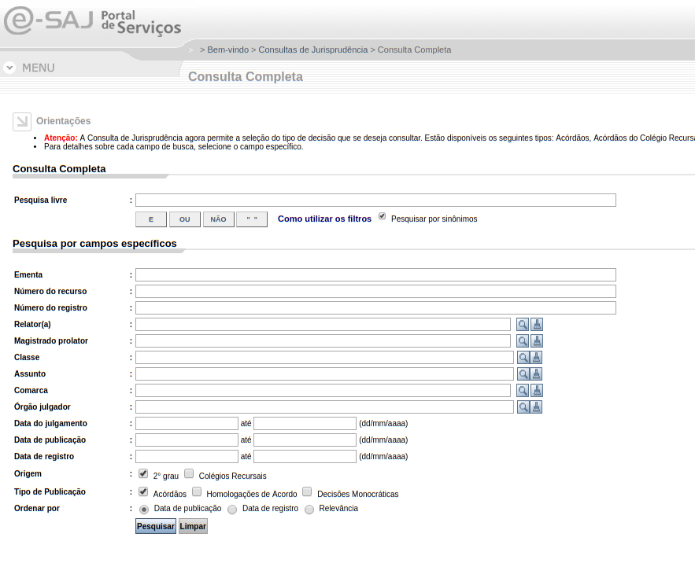
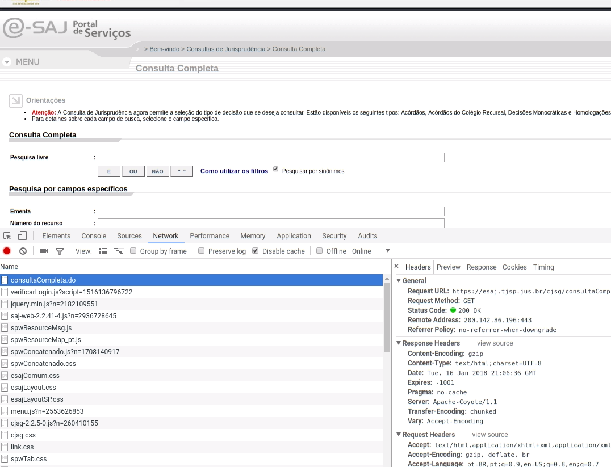

# Importação de dados

Agora nós estamos aqui:

```{r, out.width="80%", fig.align="center"}
knitr::include_graphics("imgs/wrangle.png")
```

Nessa parte, vamos aprender a **baixar dados da web**. No contexto da jurimetria, isso é muito importante por dois motivos: i) você nunca pode esperar que alguém ofereça esses dados organizados para você e ii) isso é muito divertido e é um aprendizado para a vida.

## Pipe `%>%`

```{r}
library(magrittr)
```

```{r, out.width="49%"}
knitr::include_graphics(c("imgs/magrittr.png", "imgs/magritte.jpg"))
```

Considere o seguinte exemplo:

```{r echo=TRUE}
f <- function(x, y) x + y
x <- 1
y <- 2
```

As duas linhas abaixo são equivalentes:

```{r echo=TRUE}
f(x, y)
x %>% f(y)
```

Exemplo: alcular raiz quadrada da soma dos valores de 1 a 4.

```{r echo=TRUE}
x <- c(1, 2, 3, 4)
x %>% sum() %>% sqrt()
```

Escrever esse cálculo na forma usual ficaria da seguinte forma:

```{r echo=TRUE}
sqrt(sum(x))
```

### Receita de bolo

Tente entender o que é preciso fazer. 

```{r, eval=FALSE, echo=TRUE}

esfrie(asse(coloque(bata(acrescente(recipiente(rep("farinha", 2), "água", "fermento", "leite", "óleo"), "farinha", até = "macio"), duração = "3min"), lugar = "forma", tipo = "grande", untada = TRUE), duração = "50min"), "geladeira", "20min")

```

Desistiu? Agora veja como fica escrevendo com o `%>%`:

```{r, eval=FALSE, echo=TRUE}

recipiente(rep("farinha", 2), "água", "fermento", "leite", "óleo") %>%
  acrescente("farinha", até = "macio") %>%
  bata(duraço = "3min") %>%
  coloque(lugar = "forma", tipo = "grande", untada = TRUE) %>%
  asse(duração = "50min") %>%
  esfrie("geladeira", "20min")

```

Agora o código realmente parece uma receita de bolo.

Para mais informações sobre o `pipe` e exemplos de utilização, visite a página [Ceci n'est pas un pipe](http://cran.r-project.org/web/packages/magrittr/vignettes/magrittr.html).


## Usando o Inspect

Se você quer aprender a baixar dados da web, você precisa aprender a usar o Inspect do seu navegador. Para isso, vamos abrir a página do [e-SAJ](https://esaj.tjsp.jus.br/cjsg/consultaCompleta.do).

```{r, out.width="100%", fig.align="center"}

```

- Agora clique com o botão direito e depois em "inspecionar" (vamos assumir que você está usando o Google Chrome). 
- Na tela que vai abrir, entre na aba "Network". 
- O navegador vai pedir que você atualize a página, apertando F5. Faça isso.
- Agora você verá uma lista de documentos que seu navegador baixou para carregar a página. 
- O primeiro item dessa lista, `consultaCompleta.do`, contém informações da sua consulta processual. Clique nesse item.

```{r, out.width="100%", fig.align="center"}

```

O conteúdo dessa página é a **requisição web** utilizada para acessar o e-SAJ. Basicamente, tudo o que faremos na parte de web scraping é tentar imitar o que esse site faz. 

Tenha em mente que, para atingir seus objetivos, você usará duas ferramentas: seu navegador e o RStudio.

Nas páginas que seguem, faremos uma introdução aos principais pacotes do `tidyverse` utilizados para web scraping.

## Pacotes `httr`, `xml2` e `rvest`

Esses são os três pacotes mais modernos do R para fazer web scraping. 

O pacote `xml2` tem a finalidade de estruturar arquivos HTML ou XML de forma eficiente, tornando possível a obtenção de *tags* e seus atributos dentro de um arquivo. Já o pacote `httr` é responsável por realizar requisições web para obtenção das páginas de interesse, buscando reduzir ao máximo a complexidade da programação. O pacote `rvest` é escrito **sobre** os dois anteriores e por isso eleva ainda mais o nível de especialização para raspagem de dados.

As características dos pacotes implicam na seguinte **regra de bolso**. Para trabalhar com páginas simples, basta carregar o `rvest` e utilizar suas funcionalidades. Caso o acesso à página exija ações mais complexas e/ou  artifícios de ferramentas web, será necessário utilizar o `httr`. O `xml2` só será usado explicitamente nos casos raros em que a página está em XML, que pode ser visto como uma generalização do HTML.

Esses pacotes não são suficientes para acessar todo tipo de conteúdo da web. Um exemplo claro disso são páginas em que o conteúdo é produzido por `javascript`, o que acontece em alguns sites modernos. Para trabalhar com esses sites, é necessário realmente "simular" um navegador que acessa a página web. Uma das melhores ferramentas para isso é o `selenium`. Não discutiremos `selenium` nesse curso, mas caso queira se aprofundar, acesse [aqui](http://www.seleniumhq.org/) e o pacote `RSelenium`.

### Sessões e cookies

No momento que acessamos uma página web, nosso navegador baixa alguns arquivos que "identificam" nosso acesso à página. Esses arquivos são chamados cookies e são usados pelos sites para realizar diversas atividades, como carregar uma página pré-definida pelo usuário caso este acesse o site pela segunda vez.

O `httr` e por consequência o `rvest` já guardam esses cookies de forma automática, de forma que o usuário não precise se preocupar com isso. Em casos raros, para construir o web scraper é necessário modificar esses cookies. Nesses casos, estude a função `cookies()` do `httr`.

### `GET` e `POST`

Uma requisição GET envia uma `url` ao servidor, possivelmente com alguns parâmetros nessa `url` (que ficam no final da `url` depois do `?`). O servidor, por sua vez, recebe essa `url`, processa os parâmetros e retorna uma página HTML para o navegador[^user].

[^user]: para entender sobre server side e user side, acesse [server side e user side](http://programmers.stackexchange.com/a/171210 "diferencas").

A requisição `POST`, no entanto, envia uma `url` não modificada para o servidor, mas envia também uma lista de dados preenchidos pelo usuário, que podem ser números, textos ou até imagens. Na maioria dos casos, ao submeter um formulário de um site, fazemos uma requisição `POST`.

O `httr` possui os métodos `GET` e `POST` implementados e são muito similares. A lista de parâmetros enviados pelo usuário pode ser armazenado numa `list` nomeada, e adicionado ao `GET` pelo parâmetro `query` ou no `POST` pelo parâmetro `body`. Veremos exemplos disso mais adiante.

### Outras funções do `httr`

Outras funções úteis:

- `write_disk()` para escrever uma requisição direto em disco, além de guardar na memória RAM.
- `config()` para adicionar configurações adicionais. Por exemplo, quando acessar uma página `https` com certificados inadequados numa requisição GET, rode `GET('https://www...', config(ssl_verifypeer = FALSE))`.
- `oauth_app()` para trabalhar com APIs. Não discutiremos conexão com APIs nesse curso, mas é um importante conceito a ser estudado.

### Principais funções do `rvest`

```{r eval=FALSE}
library(rvest)
```

**Para acessar páginas da web:**

- `html_session()` abre uma sessão do usuário (baixa página, carrega cookies etc).
- `follow_link()`, `jump_to()` acessa uma página web a partir de um link (tag `<a>`) ou url.
- `html_form()` carrega todos os formulários contidos numa página.
- `set_value()` atribui valores a parâmetros do formulário.
- `submit_form()` submete um formulário obtido em `html_form`.

**Para trabalhar com arquivos HTML:**

- `read_html()` lê o arquivo HTML de forma estruturada e facilita impressão.
- `html_nodes()` cria uma lista com os nós identificados por uma busca em CSS path ou XPath. `html_node()` é um caso especial que assume que só será encontrado um resultado.
- `html_text()` extrai todo o conteúdo de um objeto e retorna um texto.
- `html_table()` extrai o conteúdo de uma `<table>` e transforma em um `data_frame`.
- `html_attr()` extrai um atributo de uma tag, por exemplo `href` da tag `<a>`.

### CSS path e XPath

O CSS path e o XPath são formas distintas de buscar tags dentro de um documento HTML. O CSS path é mais simples de implementar e tem uma sintaxe menos verborrágica, mas o XPath é mais poderoso. A regra de bolso é tentar fazer a seleção primeiro em CSS e, caso não seja possível, implementar em XPath.

Esses paths serão mostrados *en passant* durante o curso, mas não serão abordados em detalhe. Caso queira se aprofundar no assunto, comece pela ajuda da função `?html_nodes`.

## Web scraping

Esta seção contém algumas melhores práticas na contrução de ferramentas no `R` que baixam e processam informações de sites de tribunais. O objetivo é ajudar o jurimetrista a desenvolver programas que sejam fáceis de adaptar no tempo.

É importante ressaltar que só estamos trabalhando com páginas que são acessíveis publicamente. Caso tenha interesse em raspar páginas que precisam de autenticação, recomendamos que estude os termos de uso do site.

Para ilustrar, usaremos como exemplo o código utilizado no trabalho das câmaras, que acessa o site do Tribunal de Justiça de São Paulo para obter informações de processos judiciais. Trabalharemos principalmente com a [Consulta de Jurisprudência](https://esaj.tjsp.jus.br/cjsg/consultaCompleta.do) e a [Consulta de de Processos de Segundo Grau](https://esaj.tjsp.jus.br/cpo/sg/open.do) do TJSP, mas também teremos um pouco de pesquisas nos diários oficiais.

### Informações iniciais

Antes de iniciar um programa de web scraping, verifique se existe alguma forma mais fácil de conseguir os dados que necessita. Construir um web scraper do zero é muitas vezes uma tarefa dolorosa e, caso o site seja atualizado, pode ser que boa parte do trabalho seja inútil. Se os dados precisarem ser extraídos apenas uma vez, verifique com os responsáveis pela manutenção do site se eles podem fazer a extração que precisa. Se os dados precisarem ser atualizados, verifique se a entidade não possui uma API para acesso aos dados.

Ao escrever um web scraper, as primeiras coisas que devemos pensar são

- Como o site a ser acessado foi contruído, se tem limites de requisições, utilização de cookies, states, etc.
- Como e com que frequência o site é atualizado, tanto em relação à sua interface como em relação aos dados que queremos extrair.
- Como conseguir a lista das páginas que queremos acessar.
- Qual o caminho percorrido para acessar uma página específica.

Sugerimos como melhores práticas dividir todas as atividades em três tarefas principais: i) *listar*; ii) *coletar* e iii) *processar*. Quando já sabemos de antemão quais são os processos que vamos acessar, a etapa de listagem é desnecessária.

Na maior parte dos casos, deixar os algoritmos de *coleta* e *processamento* dos dados em funções distintas é uma boa prática pois aumenta o controle sobre o que as ferramentas estão fazendo, facilita o *debug* e a atualização. Por outro lado, em alguns casos isso pode tornar o código ineficiente e os dados brutos obtidos podem ficar pesados.

Na pesquisa das **câmaras** (retrospectivo), o fluxo é

```
listar -> coletar -> processar -> coletar -> processar
```

Na pesquisa da **especialização** (prospectivo), o fluxo é

```
coletar -> processar -> coletar -> processar
```

## Listando processos

Listar processos significa utilizar ferramentas de busca ou minerar documentos para obter uma lista de processos judiciais. Ou seja, essa etapa do scraper serve para procurar processos que não sabíamos que existiam previamente. 

A forma de listar processos muda se seu estudo é prospectivo ou retrospectivo. Se o estudo for prospectivo, precisamos baixar dados dos **Diários de Justiça Eletrônicos** (DJE), que são arquivos PDF enormes. Se o estudo for retrospectivo, precisamos baixar dados da **Consulta de Julgados de Segundo Grau** (CJSG), que é um formulário na internet, mais simples.

- Se o seu estudo é retrospectivo, use `esaj::download_cjsg()`. CJSG significa Consulta de Julgados de Segundo Grau.
- Se o seu estudo é prospectivo, use`dje::download_dje()`. DJE significa Diário de Justiça Eletrônico

## Usando o `esaj` para listar processos

A CJSG possui vários parâmetros para consulta de decisões. As mais usadas são

- Palavras-chave
- Classe, assunto e câmaras
- Intervalos de datas

### Pesquisa por palavras-chave

A pesquisa por palavras-chave não tem segredo. Basta você seguir as especificações [deste link](https://esaj.tjsp.jus.br/WebHelp/#id_operadores_logicos.htm).

É importante ressaltar alguns pontos

- O e-SAJ **não** disponibiliza seu tesauro publicamente. Ou seja, você terá de confiar na pesquisa por sinônimos.
- Você não pode fazer uma busca completamente vazia. Ou você coloca a palavra-chave, ou você especifica outro parâmetro
- Você pode pesquisar o termo `a OU (NAO a)`, se quiser ;)

### Pesquisa por datas

Você pode usar duas datas para indexar os processos de sua pesquisa. A *data de registro* é a data em que o serventuário inclui a decisão no sistema. A *data de julgamento* é a data em que o conjunto de desembargadores proferiram a decisão.

Normalmente, a indexação aconteceria pela data de julgamento, já que queremos vincular os processos à sua data final, não em relação à uma data do sistema. No entanto, as pesquisas indexadas pela data de julgamento não são completamente reprodutíveis, já que à medida que o tempo passa, mais decisões são registradas, mudando a base de julgados.

Regra de bolso:

- Use data de registro se quiser ter certeza de que você pegou todos os casos em um determinado intervalo de tempo. 
- Use data de julgamento se você estiver pesquisando casos mais antigos (por exemplo, de 2016 para trás), já que a quantidade de decisões não registradas nesse escopo é negligenciável.

### Tabelas de classes, assuntos e câmaras

Classes e assuntos definem, respectivamente, os ritos processuais e os tipos processuais. As câmaras são as casinhas dos desembargadores, que podem ser ordinárias (fixas) ou extraordinárias (eventuais, criadas por diferentes motivos).

As classes e assuntos são definidas em formato de árvore. Cada nível dessa árvore tem uma lista de classes/assuntos e seus respectivos códigos. As tabelas de classes/assuntos podem ser obtidas pela função `esaj::cjsg_table()`.

```{r eval=FALSE, echo=TRUE}
# Não rode esses códigos. Eles baixam os dados diretos da web
classes <- esaj::cjsg_table("classes")
assuntos <- esaj::cjsg_table("subjects")
```

Já baixamos essas tabelas e colocamos em arquivos `.rds` (você sabe o que é um arquivo `.rds`?) 

```{r, echo=TRUE}
assuntos <- readRDS("data/cjsg_assuntos.rds")
classes <- readRDS("data/cjsg_classes.rds")

glimpse(assuntos)
```

Na prática, você vai procurar os assuntos que quer nessa tabela, obter os respectivos códigos e guardar em um vetor.

```{block2, type='rmdcaution'}
Cuidado com a cifra oculta! Além disso, muitos casos têm assunto vazio.
```

A tabela de câmaras segue a mesma regra. A única diferença é que não existem níveis, logo você só precisará procurar os nomes em uma coluna

```{r eval=FALSE, echo=TRUE}
camaras <- esaj::cjsg_table("courts")
```

```{r, echo=TRUE}
camaras <- readRDS("data/cjsg_camaras.rds")
glimpse(camaras)
```

### A função `download_cjsg`

Com o escopo em mãos, podemos finalmente começar a baixar dados. Esses são os argumentos da função `esaj::download_cjsg()`. Veja a documentação `?esaj::download_cjsg`

```{r, echo=TRUE}
args(esaj::download_cjsg)
```

Esse código baixa duas páginas da pesquisa de jurisprudência usando a palavra-chave `homicídio`, salvando os arquivos HTML na pasta `data-raw/cjsg`

```{r eval=FALSE, echo=TRUE}
esaj::download_cjsg("homicídio", "data-raw/cjsg", max_page = 2)
```

**Onde guardar os dados?** Ao construir um scraper, é importante guardar os dados brutos na máquina ou num servidor, para reprodutibilidade e manutenção do scraper. Se estiver construindo um pacote do R, o melhor lugar para guardar esses dados é na pasta `data-raw`, como sugerido no livro [r-pkgs](http://r-pkgs.had.co.nz). Se os dados forem muito volumosos, pode ser necessário colocar esses documentos numa pasta externa ao pacote. 

### Exercícios

1. Faça o download das páginas 2 à 5 de uma pesquisa com palavra-chave igual ao seu nome.
2. Descubra quantos resultados tem a sua pesquisa usando a função `esaj::peek_cjsg()`.

### Arrumando os dados

Para transformar os arquivos HTML em bases de dados prontas para análise, você precisa rodar `esaj::parse_cjsg()`.

```{r, echo=TRUE}
files <- dir("data-raw/cjsg", full.names = TRUE, pattern = "page")
d_cjsg <- esaj::parse_cjsg(files)

glimpse(d_cjsg)
```

### Exercícios

1. Na pesquisa que você fez, qual é a comarca de origem mais frequente?
2. Qual a diferença entre `summary` e `txt_summary`?

## Usando o `dje` para listar processos

O pacote `dje` baixa e lê diários de justiça eletrônicos. Com ele é possível baixar os PDFs e arrumá-los para obter uma base semi-estruturada.

A função `dje::download_dje()` baixa os diários referentes a um dia. No TJSP, temos seis cadernos do diário, que são salvos em arquivos separados:

- `11`: Judicial - 2a instância
- `12`: Judicial - 1a instância - capital
- `18`: Judicial - 1a instância - interior parte 1
- `13`: Judicial - 1a instância - interior parte 2
- `15`: Judicial - 1a instância - interior parte 3
- `14`: Editais e Leilões

```{r eval=FALSE, echo=TRUE}
dje::download_dje("TJSP", dates = "2018-01-12", path = "data-raw/dje")
```

### Exercício

1. O que acontece quando você tenta baixar um DJE de um dia num final de semana ou feriado?

### Parse DJE

Para parsear o DJE, primeiro você precisa transformar os PDF em textos:

```{r eval=FALSE, echo=TRUE}
dje::dje_to_text("data-raw/dje/tjsp_dje_2018-01-12")
```

E depois você aplica a função `dje::parse_dje_tjsp()` para ler os textos

```{r, echo=TRUE}
# para pegar somente 1a instancia
patterns <- glue::glue("_{c(12, 13, 15, 18)}_") %>% 
  glue::collapse("|")

#arquivos
dje_files <- dir("data-raw/dje/tjsp_dje_2018-01-12_txt", 
                 full.names = TRUE, pattern = patterns)

# veremos purrr nas próximas aulas!
d_dje <- purrr::map_dfr(dje_files, dje::parse_dje_tjsp)

glimpse(d_dje)
```

## Baixando documentos

Baixar documentos, no entando, significa simplesmente acessar pesquisas de processos individuais e salvá-las em disco. Em algumas situações, os documentos baixados (depois de limpos) podem conter uma nova lista de documentos a serem baixadas, formando iterações de coletas. A tarefa de baixar documentos pré-estabelecidos será realizada pelas funções `esaj::download_cposg()`, `esaj::download_cpopg()` e `esaj::download_decision()`.

### Download CPOSG

As funções de download de processos recebem um vetor de processos e baixam um HTML para cada um desses processos. Às vezes um número de processo corresponde a mais do que um documento. Nesse caso, ambos os documentos são baixados, adicionando-se identificação de data.

```{r eval=FALSE, echo=TRUE}
processos <- unique(d_cjsg$id_lawsuit)
esaj::download_cposg(processos, "data-raw/cposg")
```

### Baixando decisões

Se o seu estudo é retrospectivo, você também pode baixar as decisões (sentenças ou acórdãos) do processo, em PDF. O código a ser rodado nesse caso é

```{r eval=FALSE, echo=TRUE}
acordaos <- d_cjsg$id_decision
esaj::download_decision(acordaos)
```

Por trás da função `esaj::download_decision()` estamos quebrando um CAPTCHA. Essa função ainda está instável, então pode ser necessário rodá-la várias vezes para obter os documentos finais.

## Processando documentos

Finalmente, processar documentos significa carregar dados acessíveis em disco e transformar os dados brutos uma base *tidy*. Usualmente separamos a estruturação em duas etapas: i) transformar arquivos não-estruturados em um arquivos semi-estruturados (e.g. um arquivo HTML em uma tabela mais um conjunto de textos livres) e ii) transformar arquivos semi-estruturados em uma base analítica (estruturada). A tarefa de processar as páginas HTML será realizada pelas funções `esaj::parse_cjsg()` e `esaj::run_parser()`.

### Parse CPOSG

O parser da consulta de processos foi escrito de um jeito especial. Uma página de resultados tem vários blocos de informações, entre eles i) dados básicos, ii) partes, iii) movimentações e iv) decisões. Em algumas pesquisas, temos interesse em apenas uma parte desses blocos. O parser foi construído para modular essa captura de informações.

Outra diferença importante é que, nesse caso, salvamos individualmente os resultados do parse em arquivos `.rds`. Isso é feito para evitar retrabalho, já que esse processo é computacionalmente intensivo e pode acontecer do algoritmo travar no meio da execução.

```{r eval=FALSE, echo=TRUE}
# lista de arquivos
files_cposg <- dir("data-raw/cposg", full.names = TRUE)

# objeto de parse
parser <- esaj::make_parser() %>% 
  esaj::parse_data() %>% 
  esaj::parse_parts() %>% 
  esaj::parse_movs() %>% 
  esaj::parse_decisions()

# rodar parse
d_cposg <- esaj::run_parser(file = files_cposg, 
                            parser = parser, 
                            path = "data-raw/cposg_rds")
```

```{r}
rds_files <- dir("data-raw/cposg_rds", full.names = TRUE)
d_cposg <- purrr::map_dfr(rds_files, readRDS)

d_cposg
```

### Exercícios

1. Estude o objeto `d_cposg`. O que temos na coluna `data`? E na coluna `parts`?
2. Qual é o outro parâmetro da função `esaj::run_parser()`, e o que ele faz?

**OBS**: Os objetos `data`, `parts`, `movs` e `decisions` do `d_cposg` são chamados de *list columns*.

## Pacote `abjutils`

### Trabalhando com números de processos

O número identificador de um processo judicial utilizado atualmente pelos tribunais é chamado número CNJ, criado na Resolução 65 do CNJ. A resolução define o padrão `NNNNNNN-DD.AAAA.J.TR.OOOO`, descrito abaixo. 

- `NNNNNNN`: Número identificador do processo.
- `DD`: Dígito verificador gerado a partir da aplicação do algoritmo Módulo 97 Base 10,
conforme Norma ISO 7064:2003.
- `AAAA`: Ano do ajuizamento do processo.
- `J`: Segmento do poder judiciário. No nosso caso, esse número é sempre 8, que identifica
a Justiça Estadual.
- `TR`: Identifica o tribunal. No nosso caso, esse número é sempre 26 (TJSP).
- `OOOO`: Identifica a unidade de origem do processo. No nosso caso, as possíveis
configurações identificam os foros de São Paulo. Na maioria dos casos, o número
também identifica a comarca, pois existem poucas comarcas com mais de um foro (e.g.
a comarca de São Paulo, que possui mais de dez foros regionais). 

```{r, echo=TRUE}
id_montado <- "0000009-15.2015.8.26.0558"
id_limpo_dig <- "00000091520158260558"
id_limpo_ndig <- "000000920158260558"
```

As funções `abjutils::build_id()` e `abjutils::clean_id()` montam ou limpam o número do processo.

```{r, echo=TRUE}
abjutils::build_id(id_limpo_dig)
```

```{r, echo=TRUE}
abjutils::clean_id(id_montado)
```

A função `abjutils::extract_parts()` extrai todos os componentes do número do processo.

```{r, echo=TRUE}
abjutils::extract_parts(id_montado)
```

A função `abjutils::separate_cnj()` faz o mesmo, mas em uma coluna do banco de dados

```{r, echo=TRUE}
d_cjsg %>% 
  abjutils::separate_cnj("id_lawsuit", remove = FALSE) %>% 
  glimpse()
```

A função `abjutils::calc_dig()` calcula o dígito verificador do processo a partir do número incompleto. A função `abjutils::check_dig()` checa se o dígito do processo está correto. Essas funções são úteis para i) gerar números de processo aleatórios e ii) arrumar erros de parse, por exemplo, o resultado da leitura de um DJE ou de um PDF escaneado.

```{r, echo=TRUE}
abjutils::calc_dig(id_limpo_ndig)
```

```{r, echo=TRUE}
abjutils::check_dig(id_montado)
```

Finalmente, a função `abjutils::sample_cnj()` serve para criar amostras de números de processos. Esses pocessos podem ser manifestos ou não. Em algumas pesquisas mais complicadas (e.g. nossa pesquisa sobre processamento de homicídios) esse tipo de abordagem é necessária.

```{r, echo=TRUE}
set.seed(1)
abjutils::sample_cnj(n = 10, foros = "0001", anos = 2015:2017, 
                     orgao = "8", tr = "26", 
                     first_dig = 0, return_df = FALSE) %>% 
  abjutils::build_id()
```

### Trabalhando com acentos

A função `abjutils::rm_accent()` serve para tirar acentos de um texto

```{r, echo=TRUE}
abjutils::rm_accent("Têxto cóm açèntõs")
```

Só isso! Mas extremamente útil. Outra versão dessa função pode ser encontrada no pacote `rslp`.

Para quem é desenvolvedor de pacotes, a função `abjutils::escape_unicode()` é muito útil: ela transforma todos os acentos em códigos do tipo `\uxxxx`, permitindo que o pacote funcione em diferentes plataformas, sem os famosos problemas de encoding. Essa função não é para ser utilizada diretamente, mas sim como um *addin* do RStudio.

## Wrap-up

Nessa aula, vimos

- Definição do pipe `%>%`
- Um pouco sobre web scraping
    - Usar o inspect!
    - pacotes `httr`, `xml2` e `rvest`
- Scrapers jurimétricos
    - **listar** números com `dje::download_dje()` e `esaj::download_cj*g()`.
    - **coletar** documentos com `esaj::download_cpo*g()`.
    - **processar** documentos com `esaj::run_parser()`.
- Pacote `abjutils`
    - Trabalhando com número CNJ
    - Trabalhando com acentos: `abjutils::rm_accent()`
    
Na próxima vez, vamos trabalhar as bases de dados obtidas, estudar expressões regulares e mais alguns pacotes do `tidyverse`.

