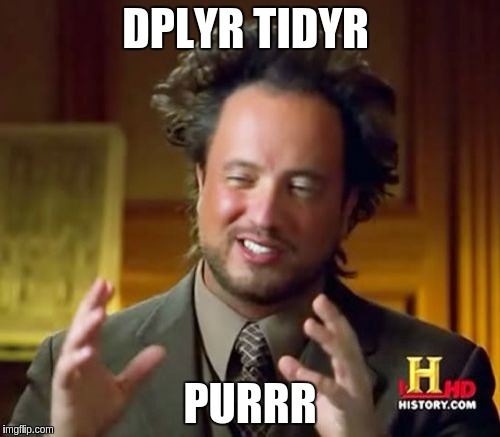
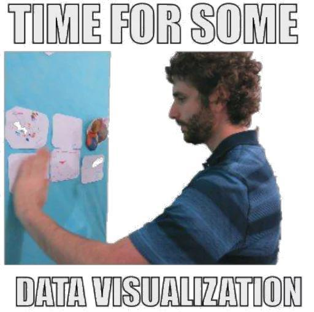

# Transformação de dados 2

Até agora, estudamos as principais ferramentas de transformação de dados do `tidyverse`. Hoje vamos aumentar um pouco mais nosso toolkit e vamos utilizá-lo na prática nos exempos das câmaras e especialização.

### Na última vez

- `lubridate`: `dmy()` & friends.
- `stringr`: família `str_*()`
    - um pouquinho de regex
- `dplyr`: 5 verbos `select`, `filter`, `mutate`, `arrange`, `summarise`

### Setup

1. Logar no servidor http://r.abj.org.br
2. No projeto r4jurimetrics, aba git -> Pull
3. Abrir o arquivo 03-vectors.Rmd
4. Rodar `library(tidyverse)`
5. Ler as bases:

```{r}
d_cjsg <- read_rds(glue("{path}/d_cjsg.rds"))
d_cposg <- read_rds(glue("{path}/d_cposg.rds"))
```

Você, depois dessa aula


```{r}

```

Se você não praticar depois

```{r}

```

## Funções do `tidyr`

O `dplyr` está para o `tidyr` assim como tesoura/cola está para um alicate/martelo.

Enquanto o `dplyr` faz recortes na base (com `filter()`e `select()`) e adições simples (`mutate()`, `summarise()`), o `tidyr` mexe no **formato** da tabela (`gather()`, `spread()`) e faz modificações menos triviais.

### `gather`

- "Empilha" o banco de dados

```{r, echo=TRUE, warning=FALSE, message=FALSE}
d_cjsg %>% 
  filter(!is.na(id_decision)) %>% 
  select(id_decision:dt_registration) %>% 
  gather(key, value, -id_decision) %>% 
  arrange(id_decision)
```

### `spread`

- "Joga" uma variável nas colunas
- É essencialmente a função inversa de `gather`

```{r, echo=TRUE}
d_cjsg %>% 
  filter(!is.na(id_decision)) %>% 
  select(id_decision:dt_registration) %>% 
  gather(key, value, -id_decision) %>% 
  spread(key, value)
```

### Unindo e separando colunas

- `unite` junta duas ou mais colunas usando algum separador (`_`, por exemplo).
- `separate` faz o inverso de `unite`, e uma coluna em várias usando um separador.

```{r, echo=TRUE, echo=TRUE}
d_cjsg %>% 
  select(id_lawsuit, class_subject) %>% 
  separate(class_subject, c('classe', 'assunto'), sep = ' / ', 
           extra = 'merge', fill = 'right') %>% 
  count(assunto, sort = TRUE)
```

### List columns: `nest` e `unnest`

`nest` e `unnest` são operações inversas e servem para tratar dados complecos, como o que temos em `d_cposg`

```{r, echo=TRUE, echo=TRUE}
d_partes <- d_cposg %>% 
  select(id_lawsuit, parts) %>% 
  unnest(parts)

d_data <- d_cposg %>% 
  select(id_lawsuit, data) %>% 
  unnest(data)
```

### Joins

Para juntar tabelas, usar `inner_join`, `left_join`, `anti_join`, etc. O melhor material disso está em http://r4ds.had.co.nz/relational-data.html.

Exemplo de inner join:

```{r echo=TRUE}
d_cjsg %>% 
  filter(dmy(dt_registration) == "2018-01-18", !is.na(id_decision)) %>% 
  select(id_decision, id_lawsuit) %>% 
  inner_join(d_cposg, "id_lawsuit") %>% 
  glimpse()
```

Exemplo de right join:

```{r echo=TRUE}
d_cjsg %>% 
  filter(dmy(dt_registration) == "2018-01-18", !is.na(id_decision)) %>% 
  select(id_decision, id_lawsuit) %>% 
  right_join(d_cposg, "id_lawsuit") %>% 
  glimpse()
```

### Duplicatas

Para retirar duplicatas, utilizar `distinct`. Ele considera apenas a primeira linha em que encontra um padrão para as combinações de variáveis escolhidas e descarta as demais.

```{r echo=TRUE}
d_cjsg %>% 
  distinct(district)
```

Para manter as demais colunas, use `.keep_all =`:

```{r echo=TRUE}
d_cjsg %>% 
  distinct(district, .keep_all = TRUE)
```


Use `janitor::get_dupes()` para averiguar os casos em que há repetição de combinações de colunas.

```{r echo=TRUE}
d_cjsg %>% 
  janitor::get_dupes(id_lawsuit)
```


Para mais aplicações do `janitor`, ver [este blog post](http://curso-r.com/blog/2017/07/24/2017-07-24-janitor/).


<!-- ----------------------------------------------------------------------- -->


## Finalizando análise das câmaras

Agora vamos fazer gráficos!

```{r}

```


### Como se distribuem os assuntos em cada câmara?

Gráfico fraqueza:

```{r, echo=TRUE, warning=FALSE, fig.width=9, fig.height=5}
d_cjsg %>%
  separate(class_subject, c('classe', 'assunto'), 
           sep = ' / ',  extra = 'merge', fill = 'right') %>% 
  ggplot(aes(x = court, fill = assunto)) +
  geom_bar(colour = 'black', position = "fill", show.legend = FALSE)
```

Gráfico bacana:

```{r, echo=TRUE, warning=FALSE, fig.width=9, fig.height=5}
d_cjsg %>%
  ## transformacao -------------------------------------------------------------
  # tirar NA (não tem problema pois são aqueles casos que não existem)
  filter(!is.na(court)) %>% 
  separate(class_subject, c('classe', 'assunto'), sep = ' / ', 
           extra = 'merge', fill = 'right') %>%
  # categorizar os assuntos e mudar a ordem
  mutate(assunto = assunto %>% 
           str_wrap(19) %>% 
           fct_infreq() %>% # ordena o factor decrescente
           fct_rev() %>% 
           fct_lump(n = 11, other_level = "Outros")) %>% 
  # pega somente os números das câmaras e coloca zeros à esquerda
  mutate(num = parse_number(court),
         num = str_pad(num, 2, pad = "0")) %>% 
  # grafico --------------------------------------------------------------------
  ggplot(aes(x = num, fill = assunto)) +
  geom_bar(colour = 'black', position = "fill") +
  guides(fill = guide_legend(reverse = TRUE)) +
  # coisas cosméticas
  theme_minimal(14) +
  scale_y_continuous(labels = scales::percent) +
  labs(x = 'Órgão julgador', 
       y = 'Proporção de \nprocessos por assunto',
       fill = "") +
  theme(legend.position = "bottom")
```

### Quantas decisões proferidas por semana?

O segundo mostra a proporção de decisões antes e depois da virada do ano.

Primeiro, vamos montar a função que classifica as decisões (da aula passada)

```{r echo=TRUE}
# essa é a classificação final
negaram <- regex('negara?m|nega-se|negam-se', ignore_case = TRUE)
parcial <- regex('parcial', ignore_case = TRUE)
deram <- regex('deram|mantiv|dá-se|nul|conhec', ignore_case = TRUE)
extinto <- regex('extin', ignore_case = TRUE)
tipos_decisao <- function(decisoes) {
  case_when(
    str_detect(decisoes, negaram) ~ 'negado',
    str_detect(decisoes, parcial) ~ 'parcial',
    str_detect(decisoes, deram) ~ 'provido',
    str_detect(decisoes, extinto) ~ 'extinto',
    TRUE ~ "outros")
}
```

Agora, vamos pegar apenas os casos em que as pessoas entraram com recursos de apelação contra o Ministério Público.


```{r echo=TRUE}
partes_apelacoes <- d_cposg %>% 
  select(id, id_lawsuit, parts) %>% 
  unnest(parts) %>% 
  filter(part == 'Apelado', str_detect(name, '[Mm]inist')) %>% 
  # Exercício: por que usamos distinct aqui?
  distinct(id_lawsuit)
```

Agora, montamos a base de decisões

```{r echo=TRUE}
d_decisoes <- d_cposg %>% 
  select(id, id_lawsuit, decisions) %>% 
  unnest(decisions) %>% 
  # Exercício: o que faz semi_join()?
  semi_join(partes_apelacoes, "id_lawsuit") %>% 
  arrange(desc(date)) %>%  
  group_by(id_lawsuit) %>%
  # Exercício: o que faz slice()?
  slice(1) %>% 
  ungroup()

# write_rds(d_decisoes, glue("{path}/d_decisoes.rds"), compress = "bz2")

decisoes <- d_decisoes %>% 
  mutate(tipo_decisao = tipos_decisao(decision)) %>% 
  select(id_lawsuit, tipo_decisao)
```

Agora vamos juntar `d_cjsg` com a base de `decisoes` para fazer o gráfico.

```{r, echo=TRUE, fig.width=9, fig.height=5}
decisoes_semana <- d_cjsg %>%
  inner_join(decisoes, 'id_lawsuit') %>% 
  mutate(data = dmy(dt_registration)) %>%
  arrange(desc(data)) %>% 
  distinct(id_lawsuit, .keep_all = TRUE) %>% 
  mutate(semana = floor_date(data, 'week')) %>% 
  # o que faz between()?
  filter(between(semana, as.Date("2017-10-01"), as.Date("2018-01-18")))


```

Gráfico fraqueza:

```{r, echo=TRUE, fig.width=9, fig.height=5}
decisoes_semana %>%
  count(semana, tipo_decisao) %>%
  ggplot(aes(x = semana, y = n, colour = tipo_decisao)) +
  geom_line()
```

Exercício:

1. Qual o problema principal desse gráfico?


Para resolver esse problema, podemos utilizar a função `complete()`

```{r echo=TRUE}
decisoes_semana %>%
  count(semana, tipo_decisao) %>%
  complete(semana, tipo_decisao)
```

Mas ainda temos datas em que não houve nenhuma decisão! Para resolver isso, precisamos de `full_seq()`

```{r echo=TRUE}
decisoes_semana %>%
  count(semana, tipo_decisao) %>%
  complete(semana = full_seq(semana, 7), tipo_decisao, fill = list(n = 0))
```


Gráfico bacana:

```{r, echo=TRUE, fig.width=9, fig.height=5}
decisoes_semana %>%
  # mudar ordem
  mutate(tipo_decisao = fct_infreq(tipo_decisao)) %>% 
  count(semana, tipo_decisao) %>%
  # completar com zeros
  complete(semana = full_seq(semana, 7), tipo_decisao, fill = list(n = 0)) %>% 
  # gráfico
  ggplot(aes(x = semana, y = n, colour = tipo_decisao)) +
  geom_line() +
  # perfumaria
  labs(x = "Semana", y = "Quantidade de decisões", colour = "Decisão") +
  scale_x_date(breaks = scales::date_breaks("1 week"),
               labels = scales::date_format("%b %d")) +
  theme_minimal(16)
```

### Qual a proporção de decisões por câmara?

Gráfico fraqueza:

```{r, echo=TRUE, eval=TRUE, fig.width=9, fig.height=4}
d_cjsg %>% 
  distinct(id_lawsuit, .keep_all = TRUE) %>% 
  inner_join(decisoes, 'id_lawsuit') %>% 
  ggplot(aes(x = court, fill = tipo_decisao)) +
  geom_bar(position = "fill")
```

Gráfico bacana:

```{r, echo=TRUE, eval=TRUE, fig.width=9, fig.height=6}
prop_negados <- function(x) {
 sum(x == "negado") / length(x)
}

d_cjsg %>%
  distinct(id_lawsuit, .keep_all = TRUE) %>% 
  inner_join(decisoes, 'id_lawsuit') %>% 
  mutate(num = court %>% 
           parse_number() %>% 
           str_pad(width = 2, pad = "0") %>% 
           fct_reorder(tipo_decisao, prop_negados) %>% 
           fct_rev()) %>% 
  mutate(tipo_decisao = fct_infreq(tipo_decisao) %>% fct_rev()) %>% 
  # grafico
  ggplot(aes(x = num, fill = tipo_decisao)) +
  geom_bar(colour = 'black', position = 'fill', size = .3) +
  geom_hline(yintercept = 1:4 / 4, linetype = 2, alpha = .4) +
  scale_y_continuous(labels = scales::percent) +
  coord_flip() +
  # perfumaria
  guides(fill = guide_legend(reverse = TRUE)) +
  theme_minimal(16) +
  theme(legend.position = "bottom") +
  labs(x = "Câmara", 
       y = 'Proporção de processos por tipo de decisão', 
       fill = "Decisão")
```

## purrr

Ao usar programação funcional (PF) podemos criar códigos concisos e "pipeáveis", que tornam o código mais legível e o processo de debug mais simples. Além disso, códigos funcionais geralmente são paralelizáveis, permitindo que tratemos problemas grandes com poucas modificações.

Apesar de o R `base` já ter funções que podem ser consideradas elementos de PF, a implementação destas não é elegante. Este tutorial abordará a implementação de PF realizada pelo pacote `purrr`.

**Cuidado**: material altamente viciante.

```{r}
knitr::include_graphics("imgs/izbicki.jpg")
```


### Iterações básicas

As funções `map()` são quase como substitutas para laços `for`: elas abstraem a iteração em apenas uma linha. Veja esse exemplo de laço usando `for`:

```{r echo=TRUE}
soma_um <- function(x) x + 1
obj <- 10:15

for (i in seq_along(obj)) {
  obj[i] <- soma_um(obj[i])
}
obj
```

O que de fato estamos tentando fazer com o laço acima? Temos um vetor (`obj`) e queremos aplicar uma função (`soma_um()`) em cada elemento dele. A função `map()` remove a necessidade de declaramos um objeto iterador auxiliar (`i`) e simplesmente aplica a função desejada em cada elemento do objeto dado.

```{r, echo=TRUE}
soma_um <- function(x) x + 1
obj <- 10:15

obj <- map(obj, soma_um)
obj
```

#### Achatando resultados

Se quisermos "achatar" o resultado, devemos informar qual será o seu tipo. Isso pode ser feito com as irmãs da `map()`: `map_chr()` (para strings), `map_dbl()` (para números reais), `map_int()` (para números inteiros) e `map_lgl()` (para booleanos).

```{r, echo=TRUE}
obj <- 10:15

map_dbl(obj, soma_um)
```

O `purrr` também nos fornece outra ferramenta interessante para achatar listas: a família `flatten()`. `map_chr()` é um atalho para `map() %>% flatten_chr()`.

O achatamento não precisa necessariamente virar um atômico. Duas funções muito utilizadas da família `map()` são `map_dfc()` e `map_dfr()`, que equivalem a um `map()` seguido de um `dplyr::bind_cols()` ou de um `dplyr::bind_rows()` respectivamente.

`walk()` é uma versão do `map()` que não retorna nada nas iterações. Ela serve para fazer efeitos colaterais, como salvar arquivos e imprimir coisas na tela.

```{r, echo=TRUE}
map(1:2, print)
walk(1:2, print)
```


#### Fórmulas e reticências

Algo bastante útil da família `map()` é a possibilidade de passar argumentos fixos para a função que será aplicada. A primeira forma de fazer isso envolve fórmulas:

```{r, echo=TRUE}
soma_n <- function(x, n = 1) x + n
obj <- 10:15

map_dbl(obj, ~soma_n(.x, 2))
```

Precisamos colocar um til (`~`) antes da função que será chamada. Feito isso, podemos utilizar o placeholder `.x` para indicar onde deve ser colocado cada elemento de `obj`.

A outra forma de passar argumentos para a função é através das reticências de `map()`. Desta maneira precisamos apenas dar o nome do argumento e seu valor logo após a função `soma_n()`.

```{r, echo=TRUE}
soma_n <- function(x, n = 1) x + n
obj <- 10:15

map_dbl(obj, soma_n, n = 2)
```

### Iterações intermediárias

Agora que já exploramos os básicos da família `map()` podemos partir para iterações um pouco mais complexas. Observe o laço a seguir:

```{r, echo=TRUE}
soma_ambos <- function(x, y) x + y
obj_1 <- 10:15
obj_2 <- 20:25

for (i in seq_along(obj_1)) {
  obj_1[i] <- soma_ambos(obj_1[i], obj_2[i])
}
obj_1
```

Com a função `map2()` podemos reproduzir o laço acima em apenas uma linha. Ela abstrai a iteração em paralelo, aplica a função em cada par de elementos das entradas e, assim como sua prima `map()`, pode achatar o objeto retornado com os sufixos `_chr`, `_dbl`, `_int` e `_lgl`.

```{r, echo=TRUE}
soma_ambos <- function(x, y) x + y
obj_1 <- 10:15
obj_2 <- 20:25

obj_1 <- map2_dbl(obj_1, obj_2, soma_ambos)
obj_1
```

Como o pacote `purrr` é extremamente consistente, a `map2()` também funciona com reticências e fórmulas. Poderíamos, por exemplo, transformar `soma_ambos()` em uma função anônima:

```{r, echo=TRUE}
obj_1 <- 10:15
obj_2 <- 20:25

map2_dbl(obj_1, obj_2, ~.x + .y)
```

Desta vez também temos acesso ao placeholder `.y` para indicar onde os elementos
de do segundo vetor devem ir.

#### Generalização

Para não precisar oferecer uma função para cada número de argumentos, o pacote `purrr` fornece a `pmap()`. Para essa função devemos passar uma lista em que cada
elemento é um dos objetos a ser iterado:

```{r, echo=TRUE}
soma_varios <- function(x, y, z) x + y + z
obj_1 <- 10:15
obj_2 <- 20:25
obj_3 <- 30:35

obj_1 <- pmap_dbl(list(obj_1, obj_2, obj_3), soma_varios)
obj_1
```

Com a `pmap()` não podemos usar fórmulas. Se quisermos usar uma
função anônima com ela, precisamos declará-la a função no seu corpo:

```{r, echo=TRUE}
obj_1 <- 10:15
obj_2 <- 20:25
obj_3 <- 30:35

pmap_dbl(list(obj_1, obj_2, obj_3), function(x, y, z) { x + y + z })
```

#### Iterando em índices

`imap()` é um atalho para `map2(x, names(x), ...)` quando `x` tem nomes e para `map2(x, seq_along(x), ...)` caso contrário:

```{r, echo=TRUE}
obj <- 10:15

imap_chr(obj, ~paste(.x, .y, sep = "/"))
```

 Naturalmente, assim como toda a família `map()`, a `imap()` também funciona com os sufixos de achatamento.

### Iterações avançadas

Agora vamos passar para os tipos mais obscuros de laços. Cada item desta seção será mais denso do que os das passadas, por isso encorajamos todos os leitores para que também leiam a documentação de cada função aqui abordada.

#### Iterações com condicionais

Imagine que precisamos aplicar uma função somente em alguns elementos de um vetor. Veja o trecho de código a seguir por exemplo:

```{r, echo=TRUE}
dobra <- function(x) x * 2
obj <- 10:15

for (i in seq_along(obj)) {
  if (obj[i] %% 2 == 1) { 
    obj[i] <- dobra(obj[i]) 
  } else { 
    obj[i] <- obj[i] 
  }
}
obj
```

Aplicamos a função `dobra()` apenas nos elementos ímpares do vetor `obj`. Com o pacote `purrr` temos duas maneiras de fazer isso: com `map_if()` ou `map_at()`.

A primeira dessas funções aplica a função dada apenas quando um predicado é `TRUE`. Esse predicado pode ser uma função ou uma fórmula. 

```{r, echo=TRUE}
eh_impar <- function(x) x %% 2 == 1
dobra <- function(x) x * 2
obj <- 10:15

map_if(obj, eh_impar, dobra) %>% 
  flatten_dbl()
```

Com fórmulas poderíamos eliminar completamente a necessidade de funções declaradas:

```{r, echo=TRUE}
obj <- 10:15

map_if(obj, ~.x %% 2 == 1, ~.x * 2) %>% 
  flatten_dbl()
```

Para `map_at()` devemos passar um vetor de nomes ou índices onde a função deve ser aplicada:

```{r, echo=TRUE}
obj <- 10:15

map_at(obj, c(2, 4, 6), ~.x * 2) %>% 
  flatten_dbl()
```

### Redução e acúmulo

Outras funções simbólicas de programação funcional além da `map()` são `reduce()` e `accumulate()`, que aplicam transformações em valores acumulados. Observe o laço a seguir:

```{r, echo=TRUE}
soma_ambos <- function(x, y) x + y
obj <- 10:15

for (i in 2:length(obj)) {
  obj[i] <- soma_ambos(obj[i-1], obj[i])
}
obj
```

Observe como isso ficaria usando `accumulate()`

```{r, echo=TRUE}
soma_ambos <- function(x, y) { x + y }
obj <- 10:15

accumulate(obj, soma_ambos)
accumulate(obj, ~.x + .y)
```

**Obs.:** Aqui, `.x` é o valor acumulado e `.y` é o valor "atual" do objeto sendo iterado.

Se não quisermos o valor acumulado em cada passo da iteração, podemos usar `reduce()`:

```{r, echo=TRUE}
obj <- 10:15
reduce(obj, ~.x+.y)
```

Para a nossa comodidade, essas duas funções também têm variedades paralelas (`accumulate2()` e `reduce2()`), assim como variedades invertidas `accumulate_right()` e `reduce_right()`).

### Miscelânea

#### Transposição e indexação profunda

Quando precisarmos lidar com listas complexas e profundas, o `purrr` nos fornece
duas funções extremamente úteis: `transpose()` e `pluck()`. A primeira transpõe
uma lista, enquanto a segunda é capaz de acessar elementos profundos de uma lista
sem a necessidade de colchetes.

```{r, echo=TRUE}
obj <- list(
  list(a = 1, b = 2, c = 3), 
  list(a = 4, b = 5, c = 6)
)
pluck(obj, 2, "b")
str(transpose(obj))
```

**Obs.:** Se você estiver com muitos problemas com listas profundas, dê uma olhada
nas funções relacionadas a `depth()` pois elas podem ser muito úteis.

#### Aplicação parcial

Se quisermos pré-preencher os argumentos de uma função (seja para usá-la em uma
pipeline ou com alguma função do próprio `purrr`), temos `partial()`. 

```{r, echo=TRUE}
soma_varios <- function(x, y, z) x + y + z
nova_soma <- partial(soma_varios, x = 1, y = 2)
nova_soma(3)
```

#### Execução segura

Usar `tryCatch()` e `try()` no R sempre foi uma dor de cabeça enorme. O `purrr` resolve esse problema de maneira elegante e eficaz.

`quietly()` retorna uma lista com resultado, saída, mensagem e alertas, `safely()`
retorna uma lista com resultado e erro (um destes sempre é `NULL`), e `possibly()`
silencia o erro e retorna um valor dado pelo usuário.

```{r, echo=TRUE}
soma_um <- function(x) { x + 1 }
s_soma_um <- safely(soma_um, 0)
obj <- c(10, 11, "a", 13, 14, 15)

s_soma_um(obj)
```

É interessante notar que essas funções são advérbios, pois modificam as funções principais, que geralmente são verbos.

Se quiser ler mais sobre chamadas seguras, veja [o texto desse blog](http://curso-r.com/blog/2017/04/20/2017-04-09-try/)

## Exemplo: formatando arquivos

Vamos agora utilizar o `purrr` em conjunto com as outras ferramentas do `tidyverse` para trabalhar o projeto da especialização.

Nosso input de dados nesse projeto foi uma planilha enviada pela Corregedoria do TJSP, contendo três abas: infos, partes e movimentações, cada uma delas com suas respectivas colunas. Cada tabela correspondia a um ano: 2013, 2014 ou 2015.

Ao ler esses arquivos, nosso input era uma lista com três elementos, para cada ano: `d_infos`, `d_movs` e `d_partes`. Cada um desses elementos é uma `tibble`. Para exemplificar, montamos algumas tabelas de exemplo, com apenas 1000 processos por ano. Elas estão em `data-raw/espec`

**Exercício**: o que faz esse código? Dica: leia o arquivo `data-raw/espec/d_2014.rds`, guarde num objeto `d_2014` e use o elemento `d_2014$d_movs` nessa função.

```{r, echo=TRUE}
nest_infos <- function(.data, name) {
  .data %>%
    # o que faz isso?
    rename(id_lawsuit = n_processo) %>%
    # o que faz isso?
    group_by(id_lawsuit) %>%
    # o que faz isso? que raios são esses `!!` ?!
    nest(.key = !!name) %>%
    # o que faz isso?
    ungroup()
}
```

**Exercício**: o que faz esse código?

```{r, echo=TRUE}
file_to_cpo <- function(arq) {
  arq %>%
    # o que faz isso?
    read_rds() %>%
    # o que faz isso?
    imap(nest_infos) %>%
    # o que faz isso?
    reduce(left_join, by = "id_lawsuit")
}
```

**Exercício**: como você faria para montar a base de dados com esse código? Dica: você primeiro precisa listar os arquivos, aplicar funções a eles e por fim empilhar. O resultado deve ser uma `tibble` com 30000 linhas e 3 list columns

```{r, echo=TRUE}
# escreva código aqui
```

## Calculando tempos e intervalos de tempo

Um de nossos objetivos no projeto das especializações é estimar o tempo dos processos por fase. Para isso, precisamos filtrar as movimentações e obter intervalos de tempo que façam sentido.

Nesse contexto, uma função de interesse poderia ter o código abaixo.

```{r, echo=TRUE}
summarise_dt <- function(dt, txt, re, .fun, ignore_case = TRUE) {
  .fun(dt[str_detect(txt, regex(re, ignore_case = ignore_case))])
}
```

A função `summarise_dt()` faz o seguinte:

- Recebe um vetor de datas `dt` e um vetor de movimentações `txt` de entrada,
- Filtra as datas cujos textos são compatíveis com uma `regex`,
- aplica uma função `.fun` para sumarizar essas datas.

### estatísticas de movimentações

Queremos aplicar `summarise_dt()` com diversos parâmetros diferentes, para a tabela de movimentações de cada processo. Vamos analisar a função abaixo.

```{r, echo=TRUE}
summarise_movs <- function(m) {
  
  # partial assignment de summarise_dt
  partial_summarise_mov <- partial(summarise_dt, dt = m$data_mov, txt = m$mov)
  
  # calcula várias estatísticas das movimentações
  summary_movs <- tribble(
    ~tipo, ~name, ~re, ~.fun,
    # contagens
    "n", "julg", "Trânsito|Julgado", length,
    "n", "baix", "Baixa", length,
    "n", "recu", "Recurso", length,
    "n", "sent", "- Sentença", length,
    "n", "tudo", ".*", length,
    # datas
    "dt", "julg", "Trânsito|Julgado", min,
    "dt", "baix", "Baixa", min,
    "dt", "recu", "Recurso", min,
    "dt", "sent", "- Sentença", min,
    "dt", "min", ".*", min,
    "dt", "max", ".*", max) %>%
    mutate(val = map2(re, .fun, quietly(partial_summarise_mov)),
           val = map_dbl(val, "result")) %>%
    unite(variavel, tipo, name) %>%
    select(variavel, val) %>%
    # joga tudo para as colunas
    spread(variavel, val) %>%
    # refaz colunas de datas
    mutate(tempo_total = dt_max - dt_min) %>%
    mutate_at(vars(starts_with("dt_")),
              funs(as.Date(., origin = "1970-01-01")))
}
```

**Exercícios**:

1. O que faz a função `tribble()`?
2. No código abaixo, quais funções são do `dplyr`, quais são do `tidyr` e quais são do `purrr`?
3. O que faz `mutate_at()`?

### Calculando intervalos de tempo

O segredo para calcular intervalos de tempo é utilizar a função `lag()`. Esta é uma das funções do tipo *janela*, que são muito úteis para séries temporais e outras aplicações.

```{r, echo=TRUE}
summarise_decisions <- function(d_movs) {
  # algumas regex
  re_decisao <- regex("- Decisão| - Despacho", ignore_case = TRUE)
  re_concluso <- regex("Concluso", ignore_case = TRUE)
  
  d_movs %>%
    arrange(data_mov) %>%
    # dados com lag
    mutate(last_mov = lag(mov), 
           last_data_mov = lag(data_mov)) %>%
    # somente movimentações em que há decisão
    filter(str_detect(mov, re_decisao)) %>%
    # tempo entre movimentação atual e movimentação anterior
    mutate(tempo = data_mov - last_data_mov,
           tem_concluso = str_detect(mov, re_concluso)) %>%
    # restrição: somamos apenas os casos em que não há concluso na mov
    # (pode ser que existam conclusos na movimentação com lag)
    summarise(n_deci_e_desp = length(mov),
              n_deci_n_nula = sum(!tem_concluso),
              t_deci = sum((!tem_concluso) * tempo, na.rm = TRUE))
}
```

Finalmente, juntamos essas funções numa função que recebe uma `tibble` de movimentações e retorna uma `tibble sumarizada`.

```{r, echo=TRUE}
calcular_resumos <- function(d_movs) {
  # limpeza das movimentações
  clean_movs <- d_movs %>%
    filter(!str_detect("Agravo", mov)) %>%
    mutate(data_mov = dmy(data_mov)) %>%
    group_by(data_mov) %>%
    summarise(mov = str_c(mov, collapse = ", "))

  # funções definidas acima
  summ_movs <- summarise_movs(clean_movs)
  summ_decisions <- summarise_decisions(clean_movs)
  
  # concatena os dois sumários
  bind_cols(summ_movs, summ_decisions)
}
```

### Resultados

Quando a função é muito demorada, pode ser útil utilizar barras de progresso para acompanhar o andamento do download. É possível utilizar barras de progresso com o pacote `progress`, com uma pequena adaptação da função original. Exemplo:

```{r eval=FALSE, echo=TRUE}
pb <- progress::progress_bar$new(total = nrow(d_espec))
calcular_resumos_pb <- function(x) {
  pb$tick()
  calcular_resumos(x)
}
```

**Exercício**: 

1. quais outras opções interessantes temos para barras de progresso?
2. *nãrd question*: qual o tipo de objeto do `progress`?


```{r eval=FALSE, echo=TRUE}
## NAO RODE
d_espec_resumida <- d_espec %>% 
  # não vamos usar partes na análise
  select(id_lawsuit, d_infos, d_movs) %>% 
  # vamos abrir d_infos, já que tem só uma linha por processo
  unnest(d_infos) %>% 
  # vamos apenas analisar as varas cíveis do João Mendes
  filter(str_detect(vara, regex("vara cível", ignore_case = TRUE))) %>% 
  # adicionar as contagens!
  mutate(d_contas = map(d_movs, calcular_resumos_pb)) %>% 
  select(-d_movs) %>% 
  # explodir as contas
  unnest(d_contas)
```

```{r echo=TRUE}
# leia aqui
d_espec_resumida <- read_rds("data-raw/espec/d_espec_resumida.rds")
glimpse(d_espec_resumida)
```

```{r echo=TRUE, fig.width=9, fig.height=5}
library(survival)
d_surv <- d_espec_resumida %>% 
  mutate(t_deci = as.numeric(t_deci)) %>% 
  gather(tipo_tempo, tempo, tempo_total, t_deci) %>% 
  mutate(obs = n_baix > 0 | n_julg > 0 | n_sent > 0) %>% 
  filter(tempo >= 0, tempo < 1400)

fit <- survfit(Surv(tempo, obs) ~ tipo_tempo, data = d_surv)

survminer::ggsurvplot(fit, risk.table = TRUE)
```


### Wrap-up de hoje

- Terminamos o projeto das câmaras
    - Aprendemos `tidyr` no meio do caminho
    - revisitamos `ggplot2` e brincamos de visualização.
- Aprendemos as funções do `purrr`. Principais: `map()`, `map_*()`.
- Montamos a base de dados do projeto de especialização.
    - Usando todos os pacotes juntos.

Próxima aula: Modelos!
  - Sobrevivência
  - Captcha
  - Rede bayesiana (se der tempo)


