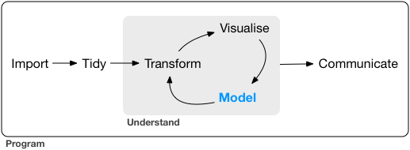
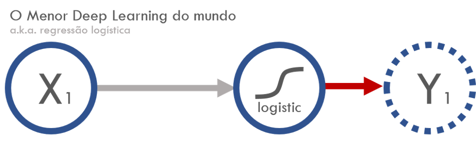

# Modelos

```{r}

```

Passamos boa parte da graduação nessa parte. Na jurimetria, demora bastante para chegar na fase de rodar modelos. Muitas vezes, no final da pesquisa um gráfico de barras é suficiente para responder às perguntas da pesquisa. Em uma fração pequena dos dados, que vem aumentando com o tempo, é necessário ajustar modelos mais sofisticados.


Na última vez, vimos

- `tidyr`, o alicate das bases de dados
- Finalizamos o projeto das câmaras
- Estudamos o maravilhoso mundo de `purrr`

Nessa última aula vamos ver

1. Exemplo de aplicação de análise de sobrevivência.
2. Quebrando Captchas com o R.

### Setup

1. Logar no servidor http://r.abj.org.br
2. No projeto r4jurimetrics, aba git -> Pull
3. Abrir o arquivo 03-vectors.Rmd
4. Rodar `library(tidyverse)`


<!-- ----------------------------------------------------------------------- -->


## Sobrevivência

Análise de sobrevivência serve para ajustar modelos com informações censuradas. A grande diferença desse tipo de modelo está na contribuição que uma observação tem na verossimilhança do modelo.

Quando temos informação pontual, a contribuição da observação $i$ na verossimilhança é dada por

$$
f(t_i|\theta)
$$

Quando temos informação censurada, só sabemos que $x_i > t_i$, logo a contribuição é dada por

$$
P(X_i > t_i|\theta) = 1-F(t_i|\theta) = S(t_i|\theta)
$$

Assim, a verossimilhança é dada por

$$
L(x|\theta) = \prod_{i=1}^n f(t_i|\theta)^{\delta_i} S(t_i|\theta)^{(1-\delta_i)}
$$

em que $\delta_i$ é um indicador de observação pontual (não-censurada).

O modelo mais conhecido de análise de sobrevivência é o Kaplan-Meier, um modelo que estima a curva de sobrevivência através da seguinte conta

$$
\hat{S}(t) = \prod_{i:t_i\leq t}\left(1-\frac{d_i}{n_i}\right)
$$

onde $d_i$ é o número de eventos ocorridos até o momento e $n_i$ é o número de processos vivos no tempo do indivíduo $i$. Essa conta leva a censura em conta de forma adequada e existem diversas razões teóricas para sua utilização. 

### Base de dados

A base de dados final desse projeto, após a realização de todos os filtros e sumarizações, além da análise da cifra oculta, está armazenada no objeto `d_fcc` (dados Fórum Central Cível).

```{r echo=TRUE}
library(tidyverse)
d_fcc <- readRDS("data/d_fcc.rds") %>% 
  mutate(censura = as.numeric(pmax(julgado, baixa, recurso, sentenca)),
         censura = if_else(censura > 0, 1, 0)) %>%
  mutate(t_deci_total = n_deci_e_desp * t_deci) %>% 
  filter(tipo != "RJ", tempo_total > 0, tempo_total < 1700)

glimpse(d_fcc)
```

### Ajustando de modelos no R

O pacote utilizado para ajuste de modelos 

- `Surv()` serve para criar a variável resposta do modelo considerando as duas variáveis que a compõem: tempo e indicador de não-censura
- `survfit()` ajusta o kaplan-meier (ou outros modelos) para uma fórmula com `Surv()` do lado esquerdo do `~` e outras covariáveis do lado direito.

```{r echo=TRUE}
library(survival)
```

Modelando o tempo total do processo. A função `broom::tidy()` mostra os principais achados do modelo numa base de dados arrumada, para ser posteriormente utilizada.

```{r echo=TRUE}
modelo_tempo_total <- d_fcc %>%
   with(survfit(Surv(tempo_total, censura) ~ tipo)) 

modelo_tempo_total %>% 
   broom::tidy()
```

Modelando o tempo de decisão

```{r echo=TRUE}
modelo_tempo_decisao <- d_fcc %>%
   with(survfit(Surv(t_deci_total, censura) ~ tipo)) 

modelo_tempo_decisao %>% 
   broom::tidy()
```

O pacote `broom` existe para diversos modelos e ajuda bastante a trabalhar com os resultados de ajustes. Dê uma olhada em https://github.com/tidyverse/broom para detalhes.

### Curvas de sobrevivência

Atualmente, o melhor pacote para fazer curvas de sobrevivência é o `survminer`. Basta rodar a função `ggsurvplot`:

```{r echo=TRUE}
survminer::ggsurvplot(modelo_tempo_total, risk.table = TRUE, data = d_fcc)
```


```{r echo=TRUE}
survminer::ggsurvplot(modelo_tempo_decisao, risk.table = TRUE, data = d_fcc)
```

Dá para observar que processos empresariais são mais lentos, mas não dá pra ver quase nada nesses gráficos. Por isso comparamos as curvas utilizando uma *estatística das ruas*.

### Comparação das curvas


```{r echo=TRUE}
plota_grafico_dificuldade <- function(broom_model) {
  # empresarial
  d_e <- broom_model %>% 
    filter(strata == "tipo=Empresarial")
  
  # comum
  d_c <- broom_model %>% 
    filter(strata == "tipo=Comum")
  
  # fuzzyjoin das duas curvas
  fuzzyjoin::difference_inner_join(d_e, d_c, 'estimate', max_dist = 0.01) %>%
  mutate(razao = time.x/time.y,
         dificuldade = as.factor(cut(1-estimate.x, breaks = 10, labels = FALSE,
                                     include.lowest = TRUE))) %>%
  group_by(dificuldade) %>%
  summarise(razao = mean(razao)) %>%
  ggplot(aes(x = as.numeric(dificuldade), y = razao)) +
  geom_col(fill = 'royalblue') + 
  theme_minimal(17)
}
```

Tempo total:

```{r echo=TRUE}
modelo_tempo_total %>% 
  broom::tidy() %>% 
  plota_grafico_dificuldade() +
  geom_hline(yintercept = 1, linetype = 1) +
  scale_y_continuous(limits = c(0, 1.5), labels = scales::percent) +
  labs(x = "Dificuldade do caso", y = "Razão entre os tempos medianos") +
  ggtitle("Razão dos tempo total versus dificuldade")
```

Tempo da decisão:

```{r echo=TRUE}
modelo_tempo_decisao %>% 
  broom::tidy() %>% 
  plota_grafico_dificuldade() +
  geom_hline(yintercept = 1, linetype = 1) +
  geom_hline(yintercept = 2, linetype = 2) +
  labs(x = "Dificuldade do caso", y = "Razão entre os tempos medianos") +
  ggtitle("Razão dos tempo de decisão versus dificuldade") +
  scale_y_continuous(labels = scales::percent)
```

### Resultados

Como resultados dessa análise, concluímos que

- Processos empresariais de fato são mais complexos que processos cíveis.
- A diferença é menor em processos de alta complexidade.
- A diferença também é maior quando consideramos somente o tempo de decisões e não o tempo total.


<!-- ----------------------------------------------------------------------- -->


## CAPTCHAs? SIM, CAPTCHAs

Sabe aquelas imagens chatas que aparecem quando você está preenchendo um formulário ou quer acessar uma página específica, pedindo para você decifrar o texto? Isso é o que chamamos de CAPTCHA (*Completely Automated Public Turing test to tell Computers and Humans Apart*). Captchas foram criados para impedir que robôs acessem determinadas páginas na web de forma irrestrita. Algumas empresas como a Google também [usam essas coisinhas para utilizar o conhecimento de seres humanos para dominar o mundo](https://www.google.com/recaptcha/intro/index.html).


```{r fig.cap='Exemplo de CAPTCHA: Consulta de CNPJ da Receita Federal.', fig.height=2.6, fig.width=8,echo=TRUE}
library(decryptr)
'imgs/receita/captcha48ec12131bab.png' %>% 
  read_captcha() %>% 
  plot()
```

Existem captchas de todo tipo: difíceis, fáceis, que fazem sentido e que não fazem sentido. Um exemplo de CAPTCHA que faz sentido são os presentes em formulários para criação de emails. Imagine se alguém fizesse um programa que criasse bilhões de contas de e-mail do gmail!

Um exemplo de CAPTCHA que não faz sentido são os sites de serviços públicos, como a Receita Federal ou de alguns Tribunais de Justiça. Algumas justificativas para isso são: i) não onerar os sistemas ou ii) a falsa ideia de que assim estão protegendo as pessoas. 

Pensando nisso, fiquei imaginando: 

> 
> Será que é possível quebrar CAPTCHAs usando modelos estatísticos? 
> 

Tornando curta uma história longa, sim, é possível! O resultado dessa brincadeira está na organização [decryptr](https://github.com/decryptr). Claro que não são todos os CAPTCHAs que conseguimos quebrar, mas estamos fazendo pesquisa, brincando nas Rackathons (hackathons com R) e discutindo várias ideias para tornar isso viável. É um esforço da comunidade para tornar os serviços públicos mais acessíveis.


<!-- ----------------------------------------------------------------------- -->


## Pacote `decryptr`

No meu último post anunciei que começaríamos uma série sobre CAPTCHAs. Uma da nossas iniciativas principais nesse tema é a criação do [pacote decryptr](https://github.com/decryptr/decryptr). Hoje veremos como usar algumas das funções principais desse pacote.

### Suposições do `decryptr`

Ao criar o `decryptr` reduzimos um pouco o escopo de CAPTCHAs que gostaríamos de incluir. Fizemos isso para não ficarmos malucos, pois existem diversos tipos de testes disponíveis na web!

As suposições são:

1. Apenas imagens `jpg` ou `png`.
1. Uma imagem possui apenas números e letras.
1. A quantidade de caracteres de um CAPTCHA é fixa.
1. Dois CAPTCHAs de mesma origem têm sempre as mesmas dimensões.
1. Não conseguimos nem queremos quebrar o [reCAPTCHA](https://www.google.com/recaptcha/intro/invisible.html).

### Instalação

O `decryptr` ainda não está no CRAN. Isso significa que para instalá-lo você precisará do `devtools`:

```{r eval=FALSE, echo=TRUE}
devtools::install_github('decryptr/decryptr')
```

As funções principais do `decryptr` são 

- `download_captcha()`: baixar imagens da web. 
- `read_captcha()`: adiciona metadados úteis a uma string com o caminho do CAPTCHA.
- `load_captcha()`: carrega a imagem na memória.
- `plot.captcha()`: método `S3` para desenhar o CAPTCHA na tela.
- `classify()`: método `S3` para classificar CAPTCHAs manualmente.
- `load_model()`: carrega um modelo já ajustado e guardado no pacote `decryptrModels`
- `train_model()`: método `S3` para ajustar um modelo para os CAPTCHAs.
- `decrypt()`: método `S3` para classificar um CAPTCHA a partir de um modelo ajustado e um caminho de imagem.

### Fluxo de utilização

O modo de uso planejado do `decryptr` está descrito na Figura \@ref(fig:fluxo).

```{r fluxo, fig.cap='Fluxo de utilização do pacote `decryptr`.', echo=FALSE, out.width="60%", fig.align="center"}
DiagrammeR::grViz('
digraph rmarkdown {
graph [layout = dot]

edge [color = black]
download->read
read->plot
read->classify
plot->classify
read->train
train->decrypt
read->decrypt
}', height = 400, width = 500)
```

### Download

A função `download_captcha()` tem cinco parâmetros:

- `url=` o link do CAPTCHA que queremos baixar.
- `n=` a quantidade de CAPTCHAs a serem baixados.
- `path=` a pasta que queremos salvar a imagem.
- `secure=` se `TRUE`, fará o download com a opção `ssl_verifypeer = FALSE` ([veja esse post](http://curso-r.com/blog/2017/03/31/2017-03-31-ssl/))
- `ext=` extensão do arquivo (`jpg`/`jpeg` ou `png`).

Essa não é uma das funções mais seguras do mundo, já que dependemos de uma boa conexão com o servidor de onde os CAPTCHAs serão baixados. A função também não trata de problemas com bloqueio de IP.

Para facilitar a utilização do `decryptr`, adicionamos algumas atalhos do tipo `download_captcha("nome")`, que já contêm os padrões para download de alguns sites específicos:

- `download_captcha("rfb")`: [Consulta de CNPJ da Receita federal](http://www.receita.fazenda.gov.br/pessoajuridica/cnpj/cnpjreva/cnpjreva_solicitacao2.asp).
- `download_captcha("saj")`: [Sistema SAJ (vários Tribunais Estaduais)](https://esaj.tjsp.jus.br/cjsg/imagemCaptcha.do).
- `download_captcha("tjmg")`: [Tribunal de Justiça de Minas Gerais](http://www4.tjmg.jus.br/juridico/sf/captcha.svl).
- `download_captcha("tjrj")`: [Tribunal de Justiça do Rio de Janeiro](http://www4.tjrj.jus.br/consultaProcessoWebV2/captcha).
- `download_captcha("tjrs")`: [Tribunal de Justiça do Rio Grande do Sul](http://www.tjrs.jus.br/site_php/consulta/human_check/humancheck_showcode.php).
- `download_captcha("trt")`: [Tribunais Regionais do Trabalho](https://pje.trt3.jus.br/consultaprocessual/seam/resource/captcha).

Exemplo:

```{r eval=FALSE, echo=TRUE}
library(decryptr)
# salva arquivo em ./img/tjmg/captcha<id>.jpeg
arq <- download_captcha("tjmg", n = 1, path = 'imgs/tjmg') 
arq
```

### Visualização

Para plotar um CAPTCHA basta ler o arquivo com `read_captcha()` e depois usar a função `plot()`. Exemplo:

```{r fig.height=1.5, fig.width=4, fig.cap='CAPTCHA do TJMG.',  echo=TRUE}
library(decryptr)
'imgs/tjmg/captcha4bfc85b5532.jpeg' %>% 
  read_captcha() %>% 
  plot()
```

Vale mencionar que esse não é um `ggplot()`, então nem tente somar layers!

### Classificação

A classificação manual de CAPTCHAs é importante para possibilitar o treino de modelos preditivos. Para classificar um CAPTCHA você pode utilizar a função `classify()`, assim:

```{r fig.height=1.5, fig.width=4, fig.cap='Classificando CAPTCHA do TJMG.',  echo=TRUE}
'imgs/tjmg/captcha4bfc85b5532.jpeg' %>% 
  classify()
```

Essa função fará duas coisas:

- Plota o CAPTCHA na tela.
- Abre um console para o usuário digitar o valor do CAPTCHA manualmente.

Ao escrever o valor o CAPTCHA, pressione `<enter>`. Após isso, a função `classify()` irá adicionar sua classificação após o nome da imagem, como no exemplo acima: `_92522`. A função `classify()` gera uma cópia para que seja impossível de perder a imagem original.

Algumas opções do `classify()`:

- `answers=` adicionar uma resposta ao invés de esperar abrir o console. Essa opção é útil quando as classficações são feitas automaticamente (e.g., por um quebrador de CAPTCHAs que usa o áudio no lugar da imagem.)
- `path=` colocar uma pasta para classificar os CAPTCHAs. Por padrão é a pasta onde os originais estão.


### Carregar modelo

A função `load_model()` é responsável por carregar modelos pré treinados

```{r,  echo=TRUE}
modelo <- decryptr::load_model("tjmg")
modelo$model
```


### Quebrar captcha

A função `decrypt` quebra o captcha a partir de uma imagem e um modelo.

```{r,  echo=TRUE}
decrypt('imgs/tjmg/captcha4bfc85b5532.jpeg', modelo)
```


Você também pode chamar `decrypt` com o nome do modelo no lugar do próprio modelo carregado, mas isso é ineficiente


Exercícios

1. Baixe 1 captcha para cada origem disponível no `decryptr`. Algum deles não funciona?
2. Desenhe esses captchas. Algum deles não funciona?
3. Quebre esse captcha usando `decrypt`. Algum deles não funciona?


<!-- ----------------------------------------------------------------------- -->


## Segmentação

Nesse post vamos discutir um pouco sobre modelar CAPTCHAs. Vou assumir que você já viu o post de introdução e o post sobre download, leitura e classificação manual de CAPTCHAs.

Digamos que você tenha uma base de dados de treino composta por $N$ imagens com os textos classificados. Nossa resposta nesse caso é uma *palavra* de $k$ caracteres (vamos considerar $k$ fixado), sendo que cada caractere $c$ pode ter $p$ valores.

O problema de modelar o CAPTCHA diretamente é que a variável resposta tem um número exponencial de combinações de acordo com o número de caracteres:

$$
\Omega = p^k.
$$

Por exemplo, um CAPTCHA com $k=6$ e $p=36$ (26 letras e 10 números), que é muito comum, possui um total de 2.176.782.336 (> 2 bilhões) combinações! E não preciso dizer que é completamente inviável baixar e modelar tudo isso de CAPTCHAs.

A alternativa imediata que aparece é tentar separar a imagem em um pedaço para cada caractere e fazer um modelo para prever caracteres. Assim nossa resposta é reduzida para $p$ categorias, que é bem mais fácil de tratar.

Vamos usar como exemplo o CAPTCHA do TJMG. Primeiro, o download:

```{r dlimg1, eval=FALSE, echo=TRUE}
arq_captcha <- decryptr::download_captcha("tjmg", n = 1, path = 'imgs/captcha')
```

Visualizando a imagem:

```{r fig.height=1.5, fig.width=4, fig.cap='CAPTCHA do TJMG.', echo=TRUE}
library(decryptr)
arq_captcha <- "imgs/captcha/captcha4c9f411d0391.jpeg"
arq_captcha  %>% 
  read_captcha() %>% 
  plot()
```

Exercício:

1. Sem separar as letras, quantas combinações temos no TJMG?


Infelizmente, segmentar a imagem nos lugares corretos é [uma tarefa difícil](https://www.usenix.org/node/185129). Pior até do que predizer as letras. Para simplificar, vamos fazer um corte fixado das letras:

```{r , fig.height=1.5, fig.width=4, fig.cap='Linhas verticais separando letras', echo=TRUE}
arq_captcha %>% read_captcha() %>% plot()
abline(v = 26 + 20 * 0:3, col = 'red')
```

Podemos também limitar os eixos `x` (tirar os espaços vazios à esquerda e à direita) e `y` (superiores e inferiores).

```{r , fig.height=1.5, fig.width=4, fig.cap='', echo=TRUE}
op <- graphics::par(mar = rep(0, 4))
arq_captcha %>% 
  read_captcha() %>% 
  dplyr::first() %>% 
  with(x) %>% 
  magrittr::extract(-c(1:7, 34:dim(.)[1]), -c(1:06, 107:dim(.)[2]), TRUE) %>%
  grDevices::as.raster() %>% 
  graphics::plot()
abline(v = 20 * 1:4, col = 'red')
abline(h = c(0, 26), col = 'blue')
```

Agora temos uma imagem de tamanho dimensões `26x20` por caractere. Nosso próximo desafio é transformar isso em algo tratável por modelos de regressão. Para isso, colocamos cada pixel em uma coluna da nossa base de dados. 

No caso do TRT, cada CAPTCHA gerará uma tabela de 6 linhas e 520 (`26 * 20`) colunas. Podemos usar esse código para montar:


```{r imgsep, echo=TRUE}
arq_captcha %>% 
  read_captcha() %>% 
  dplyr::first() %>% 
  with(x) %>% 
  magrittr::extract(-c(1:7, 34:dim(.)[1]), -c(1:06, 107:dim(.)[2]), TRUE) %>%
  as_tibble() %>% 
  rownames_to_column('y') %>% 
  gather(x, value, -y) %>% 
  mutate_at(vars(x, y), funs(parse_number)) %>% 
  mutate(letra = (x - 1) %/% 20 + 1,
         x = x - (letra - 1) * 20) %>% 
  mutate_at(vars(x, y), funs(sprintf('%02d', .))) %>% 
  unite(xy, x, y) %>% 
  spread(xy, value, sep = '') %>% 
  mutate(y = c('1', '0', '0', '1', '7')) %>% 
  select(y, everything(), -letra)
```

```{r rds, echo=TRUE, eval=FALSE}
p <- progress::progress_bar$new(total = 1500)
dados_segment <- 'data-raw/captcha' %>% 
  dir(full.names = TRUE, pattern = '_') %>% 
  map_dfr(~{
    
    p$tick()
    
    # pega a resposta dos arquivos
    words <- .x %>% 
      basename() %>% 
      tools::file_path_sans_ext() %>% 
      stringr::str_match("_([0-9]+)$") %>% 
      magrittr::extract(TRUE, 2) %>% 
      stringr::str_split('', simplify = TRUE) %>% 
      as.character()
    
    # carrega o bd do arquivo (codigo anterior)
    .x %>% 
      read_captcha() %>% 
      dplyr::first() %>% 
      with(x) %>% 
      magrittr::extract(-c(1:7, 34:dim(.)[1]), -c(1:06, 107:dim(.)[2]), TRUE) %>%
      as_tibble() %>% 
      rownames_to_column('y') %>% 
      gather(x, value, -y) %>% 
      mutate_at(vars(x, y), funs(parse_number)) %>% 
      mutate(letra = (x - 1) %/% 20 + 1,
             x = x - (letra - 1) * 20) %>% 
      mutate_at(vars(x, y), funs(sprintf('%02d', .))) %>% 
      unite(xy, x, y) %>% 
      spread(xy, value, sep = '') %>% 
      mutate(y = words) %>% 
      select(y, everything(), -letra)
  }, .id = 'captcha_id')

saveRDS(dados_segment, 'data/dados_segment.rds', compress = 'bzip2')
```

Muito bem! Agora basta rodar o mesmo para toda a base de treino e rodar um modelo. Vamos usar uma base de 1500 CAPTCHAs classificados. Essa base fica com 7500 linhas e 520 colunas. Vamos usar 6000 linhas para treino e as 1500 restantes para teste. O modelo utilizado será um `randomForest` padrão.

```{r carregabd, message=FALSE, warning=FALSE, eval=FALSE, echo=TRUE}
library(randomForest)
dados <- readRDS('data/dados_segment.rds') %>% 
  mutate(y = factor(y))

# monta bases de treino e teste
set.seed(4747) # reprodutibilidade
ids_treino <- sample(seq_len(nrow(dados)), 6000, replace = FALSE)
d_train <- dados[ids_treino, ]
d_test <- dados[-ids_treino, ]
```

```{r rodamodelo, eval=FALSE, echo=TRUE}
model_rf <- randomForest(y ~ . - captcha_id, data = d_train) 
```

```{r salvamodelo, echo=TRUE, message=FALSE, warning=FALSE, eval=FALSE}
# saveRDS(model_rf, 'data/model_segment_rf.rds', compress = 'bzip2')
model_rf <- readRDS('data/model_segment_rf.rds')
```

O resultado do modelo pode ser verificado na tabela de observados *versus* preditos na base de teste. O acerto foi de 99.5% em cada caractere! Assumindo que o erro não depende da posição do caractere no CAPTCHA, teremos um acerto de aproximadamente 97.5% para a imagem.

```{r errosTJMG, eval=FALSE,, echo=TRUE}
d_test %>% 
  mutate(pred = predict(model_rf, newdata = .)) %>% 
  count(y, pred) %>% 
  spread(pred, n, fill = '.') %>% 
  remove_rownames() %>% 
  knitr::kable(caption = 'Tabela de acertos e erros.')
```


|y  |0   |1   |2   |3   |4   |5   |6   |7   |8   |9   |
|:--|:---|:---|:---|:---|:---|:---|:---|:---|:---|:---|
|0  |156 |.   |.   |.   |.   |.   |.   |.   |.   |.   |
|1  |.   |160 |.   |.   |.   |.   |.   |.   |.   |.   |
|2  |.   |.   |147 |.   |.   |.   |.   |.   |.   |.   |
|3  |.   |.   |1   |140 |.   |.   |.   |.   |.   |.   |
|4  |.   |2   |.   |.   |150 |.   |.   |.   |.   |.   |
|5  |.   |.   |.   |.   |.   |153 |.   |.   |.   |.   |
|6  |.   |.   |.   |.   |.   |.   |143 |.   |.   |.   |
|7  |.   |.   |.   |.   |.   |.   |.   |152 |.   |.   |
|8  |.   |.   |.   |2   |1   |.   |.   |.   |139 |.   |
|9  |.   |.   |.   |.   |.   |.   |.   |.   |.   |154 |


### Nem tudo são rosas

O resultado para o CAPTCHA do TJMG é bastante satisfatório, mas infelizmente não generaliza para outros CAPTCHAs. Tome por exemplo o CAPTCHA da Receita Federal abaixo. Nesse caso, a posição dos caracteres muda significativamente de imagem para imagem, e assim fica difícil cortar em pedaços.

```{r generalize, echo=TRUE, out.width = '12%'}
dir('imgs/receita', full.names = TRUE) %>% 
  purrr::walk(~plot(magick::image_read(.x)))
```

O mesmo modelo aplicado ao CAPTCHA da Receita possui acerto de 78.8% do caractere, o que equivale a apenas 23.8% de acerto para toda a imagem. Veja os resultados na tabela abaixo.

### Exercício

1. Por quê você acha que o modelo da receita é pior?
2. O que você faria para melhorar o poder preditivo?


Claro que seria possível melhorar o poder preditivo com uma modelagem mais cuidadosa: nós usamos todos os parâmetros padrão da `randomForest` e não consideramos outros possíveis modelos. Mas acreditamos que o problema essencial está na segmentação, e não na modelagem após a segmentação. 

Nos próximos posts, vamos mostrar como resolver o CAPTCHA da Receita com maior acurácia utilizando técnicas de Deep Learning que consideram a etapa de segmentação dentro da modelagem.


### Wrap-up

- Não dá para considerar todas as combinações de valores de um CAPTCHA diretamente num modelo de regressão.
- Uma forma de resolver um CAPTCHA é segmentando a imagem em pedaços de mesma largura.
- Para montar a base de treino, criamos uma coluna para cada pixel. Um CAPTCHA corresponde a uma base com $k$ linhas e número de colunas igual ao número de pixels.
- No CAPTCHA do TJMG os resultados são satisfatórios.
- Já para CAPTCHA da Receita essa estratégia pode ser ineficaz.
- Vamos evoluir essa análise para técnicas que consideram a etapa de segmentação dentro da modelagem.


<!-- ----------------------------------------------------------------------- -->


## Estrutura de Dados

No último post sobre [CAPTCHAs](http://curso-r.com/tags/captcha/) nós vimos que a segmentação das imagens (separar uma imagem em várias imagens, uma para cada caractere) é um problema complicado. Definir uma largura fixa ou utilizar outros métodos ad-hoc para segmentar as imagens pode dar bons frutos, mas não é o suficiente para quebrar CAPTCHAs mais complexos, como o da Receita Federal.

Alguns meses atrás, tentamos resolver esse problema de várias formas. Uma delas foi utilizar algoritmos de agrupamento ($k$-médias) ou de identificação de conjuntos conectados. Esses algoritmos se mostraram instáveis e não aumentaram muito o poder preditivo. Outra ideia que tentamos foi criar vários critérios de corte fixos e incluir todas as colunas geradas na base de dados. Mas isso deixou nos deixou com uma dimensão muito grande pra tratar, e parecia que os modelos precisavam de muito mais dados pra começarem a funcionar.

Foi aí que o Daniel nos disse que estava trabalhando no pacote do Keras e que existia uma forma de trabalhar com a imagem completa, sem segmentar. A tarefa de segmentação seria "parametrizada" num modelão complexo de deep learning e conseguiríamos resolver o problema **sem pré-processamento**.

Inicialmente, eu e o Athos ficamos perplexos com a ideia. Foi só quando o Daniel mostrou um modelo que **acertava 100% dos CAPTCHAs do TJMG** que fomos convencidos, e passamos a chamar esse modelo de "magia negra".

Vamos discutir como montar a base para fazer a magia negra.

### Resposta

Nossa resposta não é mais uma categoria, e sim uma matriz. A matriz tem $k$ linhas (número de letras em um CAPTCHA) $p$ colunas (número de valores possíveis de um caractere). O elemento $(i,j)$ vale `1` se na posição $i$ aparece a letra relativa à posição $j$.

Assim, 

```
g3kvjg
```

vira isso: (substituí `0` por `'.'` para ficar mais fácil de ver)

```{r echo=TRUE}
m <- "imgs/receita/captcha48ec12131bab_g3kvjg.png" %>% 
  read_captcha(ans_in_path = TRUE) %>% 
  first() %>% 
  with(y)
m[m == 0] <- '.'
as_tibble(m) %>% 
  rownames_to_column('posicao')
```

Isso para uma imagem. Vamos precisar de uma terceira dimensão, que são as "linhas" de nossa resposta (uma para cada CAPTCHA).

Nosso `y` final é um array de dimensões $n \times k \times p$. Achou estranho? Estamos só começando!

### Explicativas

Uma imagem nada mais é do que uma matriz de pixels. Cada elemento da matriz é um número entre zero e um indicando o quanto de cor há nesse pixel. Assim, zero significa preto (ausência de cor), e um significa branco (todas as cores). Valores intermediários dão escala de cinza. Para representar imagens com cores, é necessária uma terceira dimensão de tamanho 3, indicando os pesos de `R` (*red*) `G` (*green*) e `B` (*blue*), mas não faremos isso.

Assim, nossa base de dados de explicativas é um array de dimensões 

$$
n \times h \times w \times 1
$$

em que $h$ e $w$ são a altura e a largura da imagem, respectivamente.


<!-- ----------------------------------------------------------------------- -->


## Redes neurais com `keras`

Agora vamos estudar um pouco de redes neurais!


### Novos tempos?

- Nos últimos anos os tipos de dados mudaram. Hoje qualquer coisa é considerada dado, e tudo está vindo em um volume gigante.
- Coisas muito importantes hoje em dia:

```{r echo=FALSE, out.width="23%"}
knitr::include_graphics(c("imgs/friends.jpg", 
                          "imgs/acordao.png", 
                          "imgs/wave.png"))
```

Em paralelo (ou como consequência), tivemos diversos avanços na estatística:

- Regularização
- Inferência Bayesiana
- Modelos não paramétricos
- Outros

Tudo isso está inserido numa caixinha chamada *statistical learning*. Muito disso se deve aos avanços computacionais, como

- Coisas na cloud; computação barata
- Paralelização
- O advento das GPU

Mas não foi só isso. O que temos hoje também é fruto de uma comunidade cada vez mais ativa, interdisciplinar e colaborativa

- Popularização do Github
- Popularização do R e do python
- Análises reprodutíveis

### Deep Learning

Mas afinal, o que é o deep learning?

- Popularidade recente da área de deep learning.
- Promete fazer muitas coisas.
- Tem um linguajar diferente do que estamos acostumados.

Essa é a imagem mais encontrada quando pesquisamos esse conceito

```{r echo=FALSE, out.width='50%'}
knitr::include_graphics("imgs/deepl.png")
```

### Problemas

- Muita, muita gente usando.
- Mercado está pedindo. Só se fala nisso.
- Falsa ideia de que não aprendemos nada sobre isso na faculdade
- O que estudamos é ultrapassado?

Juntando com o marketing, temos a era da depressão dos estatísticos


```{r, out.width="33%"}
knitr::include_graphics(c("imgs/diff.png", "imgs/quit.png", "imgs/dead.png"))
```


### Não entre em pânico!

- Existem muitos falsos cognatos.
- A maioria das coisas que estudamos é útil.
- E, ainda assim, vale à pena estudar os conceitos.

## Regressão logística

Componente aleatório

$$
Y|x \sim \text{Bernoulli}(\mu)
$$

Componente sistemática

$$
g(\mu) = g(P(Y=1\,|\,x)) = \alpha + \beta x
$$

Função de ligação

$$
g(\mu) = \log\left(\frac{\mu}{1-\mu}\right)
$$

## Função Deviance

$$
\begin{aligned}
D(y,\hat\mu(x)) &= \sum_{i=1}^n 2\left[y_i\log\frac{y_i}{\hat\mu_i(x_i)} + (1-y_i)\log\left(\frac{1-y_i}{1-\hat\mu_i(x_i)}\right)\right] = \\
&= 2 D_{KL}\left(y||\hat\mu(x)\right),
\end{aligned}
$$

onde $D_{KL}(p||q) = \sum_i p_i\log\frac{p_i}{q_i}$ é a divergência de Kullback-Leibler.

Agora, veja um modelo de deep learning:


```{r echo=FALSE, out.width='80%'}

```

Faz uma combinação linear inputs $x$, adiciona um viés (*bias*) e depois aplica uma função de ativação não linear. No nosso caso, adiciona um parâmetro multiplicando $x$ e um viés fixo, fazendo

$$
f(x) = w x + \text{bias}
$$

A função de ativação é uma sigmoide, dada por

$$
\sigma(x) = \frac{1}{1 + e^{-x}}
$$

Notou alguma similaridade?

### Função de custo: categorical cross-entropy

$$
\begin{aligned}
H(p, q) &= H(p) + D_{KL}(p||q) \\
&= -\sum_x p(x)\log(q(x))
\end{aligned}
$$

No nosso caso, isso é equivalente a uma constante mais a função deviance.

Para ajustar os parâmetros, existem diversos algoritmos de otimização. Um dos mais utilizados é o de descida de gradiente estocástico.

### Exemplot

```{r warning=FALSE, message=FALSE, echo=TRUE}
logistic <- function(x) 1 / (1 + exp(-x))

n <- 100000
set.seed(19910401)
dados <- tibble(
  x = runif(n, -2, 2),
  y = rbinom(n, 1, prob = logistic(-1 + 2 * x))
)
dados
```

Ajustando uma regressão logística no R

```{r, echo=TRUE}
modelo <- glm(y ~ x, data = dados, family = 'binomial')
broom::tidy(modelo)
```

Ajustando um deep learning com o keras

```{r, echo=TRUE}
library(keras)
input_keras <- layer_input(shape = 1, name = "modelo_keras")

output_keras <- input_keras %>% 
  layer_dense(units = 1, name = "camada_unica") %>%
  layer_activation("sigmoid", 
                   input_shape = 1, 
                   name = "link_logistic")

# Constrói a nossa hipótese f(x) (da E[y] = f(x))
modelo_keras <- keras_model(input_keras, output_keras)
```

A especificação do modelo é dada por

```{r, echo=TRUE}
summary(modelo_keras)
```

Agora, especificamos a função de perda e a forma de otimizar

```{r, echo=TRUE}
modelo_keras %>% 
  compile(
    loss = 'binary_crossentropy',
    optimizer = "sgd"
  )

modelo_keras %>% 
  fit(x = dados$x, y = dados$y, epochs = 3)
```


```{r, echo=TRUE}
modelo_keras %>% 
  get_layer("camada_unica") %>% 
  get_weights()
```

Algumas dúvidas que podem surgir para você nesse momento:


- Se é a mesma coisa, por que ele está ganhando tanta popularidade?
- Devo estudar deep learning ou posso continuar fazendo regressão logística?


<!-- ----------------------------------------------------------------------- -->


## Redes neurais convolucionais


Nosso objetivo é aprender a aplicar a **operação da convolução** em imagens, replicando o modelo já ajustado dos captchas. 


### O que é convolução, afinal?

```{r, out.width="50%", echo=FALSE}
knitr::include_graphics("imgs/vivalaconv.jpg")
```


Convolução é uma técnica usada há muito tempo na área de *visão computacional* para aplicar filtros em imagens e detectar padrões. Basicamente, o que ela faz é calcular um novo valor para um pixel da imagem com base nos pixels da vizinhança. Por exemplo, você pode fazer com que o pixel $(i,j)$ da sua imagem seja atualizado pela soma ponderada dos valores dos pixels na vizinhança.


Uma forma esperta de fazer essa soma ponderada é criando uma matriz de pesos: dessa forma, você não precisa ficar procurando os pontos da vizinhança. Para cada ponto $(i,j)$, você pega o subset da matriz de vizinhança, multiplica pontualmente pela matriz de pesos e soma todos os valores. Isso é *exatamente* o que a convolução faz.

Daqui em diante, chamaremos essa matriz de pesos de **kernel**. Considere esse exemplo 3x3:

```{r, echo=TRUE}
kern_horizontal <- rbind(c(-1,-1,-1),
                         c( 0, 0, 0),
                         c( 1, 1, 1))
kern_horizontal
```

E considere essa imagem super complexa:

```{r, out.width="30%", echo=TRUE, no.mar=TRUE}
"imgs/emoji3.png" %>% 
  magick::image_read() %>% 
  plot()
```

Na prática, essa imagem é isso aqui (tirei algumas linhas e colunas):

```{r, echo=TRUE}
emoji <- decryptr:::load_image("imgs/emoji3.png")[,,1] 
round(emoji, 1)[1:10, 1:12]
```

Tome por exemplo o ponto $(i,j) = (12,16)$. A vizinhança 3x3 em torno desse ponto é dada por

```{r, echo=TRUE}
emoji[12 + (-1):1, 16 + (-1):1]
```

A operação de convolução é feita da seguinte forma: 

```{r, echo=TRUE}
sum(emoji[12 + (-1):1, 16 + (-1):1] * kern_horizontal)
```

Pronto, esse é o valor a ser colocado no ponto $(i,j)$. Fazemos isso para todos os outros pontos. Algumas dúvidas que podem rolar nesse ponto:


Exercício

1. Qual o resultado se aplicarmos a convolução no ponto (12, 12)?
2. Qual o resultado se aplicarmos a convolução no ponto (1, 1)?


**Q**: Mas os números não devem variar de 0 a 1?

**R**: Não! Para visualizar a imagem, você poderia normalizar essas quantidades (por exemplo, dividindo pelo máximo). Mas quem disse que o resultado da sua operação precisa ser visualizável? O resultado pode até ser negativo. Sem problemas.

> Para visualização, por padrão os valores menores que zero são substituídos por zero (preto) e valores maiores que um são substituídos por um (branco). 


**Q**: Mas e no canto da imagem, o que fazemos?

**R**: Nos cantos, você tem duas opções: 1) considerar apenas os pixels *válidos*, ou seja, pixels em que você consegue encaixar a matriz `kernel` inteira, resultando numa matriz de tamanho menor; ou 2) criar uma borda na imagem, preenchendo com zeros, para que toda a imagem fique com pixels válidos. Por isso que o `keras` disponibiliza as opções *valid* (apenas os válidos) e *same* (mantém a mesma dimensão).


**Q**: E se a imagem for colorida?

**R**: Boa pergunta! Se a imagem for colorida, você pode considerar um `kernel` diferente para cada cor, e depois você soma todos os valores. Mais pra frente, chamaremos as cores de *canais*, pois teremos muito mais do que 3 kernels.

Com base nisso, montamos um algoritmo que faz a conta para todos os pixels, já criando uma borda na imagem:

```{r, echo=TRUE}
convolve <- function(img, kern) {
  # monta a bordinha na imagem. A borda deve ter (tamanho kernel) / 2,
  # de tamanho, arredondando para baixo
  pad <- floor(dim(kern)[1] / 2)
  img_pad <- matrix(0, nrow = nrow(img) + 2 * pad, ncol = ncol(img) + 2 * pad)
  img_pad[pad + 1:nrow(img), pad + 1:ncol(img)] <- img[,,1]
  # aplica a convolução nos pontos da imagem
  for (i in seq_len(nrow(img))) {
    for (j in seq_len(ncol(img))) {
      img[i, j, 1] <- sum(img_pad[i + 0:(2 * pad), j + 0:(2 * pad)] * kern)
    }
  }
  img[,,2] <- img[,,3] <- img[,,1]
  img
}
```


Exercício

1. Qual é o problema do código acima?


Voltando para nossa imagem agora. No nosso caso, o resultado fica assim:

```{r, no.mar=TRUE, out.width="30%", echo=TRUE}
"imgs/emoji3.png" %>% 
  decryptr:::load_image() %>% 
  convolve(kern_horizontal) %>% 
  magick::image_read() %>% 
  plot()
```

Ficou um pouco assustador, não? Essa matriz não foi escolhida por acaso. Ela serve para destacar padrões horizontais da imagem. Como a primeira linha é formada `-1`s e a última é formada por `1`s, a matriz fica com valor alto se a parte de cima do pixel for preta e a parte de baixo for branca (`grande * 1 + pequeno * (-1)`). A parte destacada da imagem acabou sendo os olhos (pois temos maior concentração de pixels pretos ali), além das extremidades superior e inferior do rosto.

Com esse kernel aqui (vertical), a parte destacada do rosto são as extremidades dos lados:

```{r, no.mar=TRUE, out.width="30%", echo=TRUE}
kern_vertical <- rbind(c(-1, 0, 1),
                       c(-1, 0, 1),
                       c(-1, 0, 1))
kern_vertical

"imgs/emoji3.png" %>% 
  decryptr:::load_image() %>% 
  convolve(kern_vertical) %>% 
  magick::image_read() %>% 
  plot()
```


### Aplicando nos captchas


Não tem segredo! Basta reaplicar o que já vimos. Vou apenas introduzir uma nova função chamada `add_bias()`, que simplesmente adiciona uma constante numérica para a matriz. Isso pode auxiliar na visualização, pois controlamos melhor os valores que ficam dentro do intervalo `[0,1]`. Lá na frente você entenderá o porquê do "bias".

```{r, echo=TRUE}
add_bias <- function (x, b) x + b
```

Esse é o resultado de adicionar o kernel vertical e bias de `0.6`.

```{r, echo=TRUE}
arq <- "imgs/receita/captcha48ec12131bab.png"
```


```{r, fig.height=1, fig.width=3.6, no.mar=TRUE, echo=TRUE}
op <- graphics::par(mar = rep(0, 4))
arq %>% 
  decryptr:::load_image() %>% 
  convolve(kern_vertical) %>% 
  add_bias(.6) %>% 
  magick::image_read() %>% 
  plot()
```

Agora o kernel na horizontal. Note que identificamos padrões das linhas horizontais que tentam atrapalhar a visão das letras.

```{r, fig.height=1, fig.width=3.6, no.mar=TRUE, echo=TRUE}
op <- graphics::par(mar = rep(0, 4))
arq %>% 
  decryptr:::load_image() %>% 
  convolve(kern_horizontal) %>% 
  add_bias(.6) %>% 
  magick::image_read() %>% 
  plot()
```

Colocando um após o outro, temos um resultado bem esquisito:

```{r, fig.height=1, fig.width=3.6, no.mar=TRUE, echo=TRUE}
op <- graphics::par(mar = rep(0, 4))
arq %>% 
  decryptr:::load_image() %>% 
  convolve(kern_horizontal) %>% 
  convolve(kern_vertical) %>% 
  add_bias(.5) %>% 
  magick::image_read() %>% 
  plot()
```

Também vou introduzir uma função chamada `relu()` aqui. **ReLu** significa *Restricted Linear Unit* e é uma função bem simples que zera tudo aquilo que é negativo e mantém tudo aquilo que é positivo. Assim, temos:

```{r, echo=TRUE}
relu <- function(x) (x + abs(x)) / 2
relu(-1)
relu( 3)
```

Para visualização, essa função não serve para muita coisa, pois já fazemos a substituição de valores negativos por zero. No entanto, podemos fazer combos com a aplicação de várias convoluções. O resultado dos combos não seria possível somente com somas e multiplicações. 

Na prática, isso significa que com a aplicação de convoluções, bias e ReLu, podemos montar operações **não lineares** para extrair componentes da imagem.

Olhe o exemplo abaixo. Parece que consegui identificar bem as coisas que são inúteis na imagem.

```{r, fig.height=1, fig.width=3.6, no.mar=TRUE, echo=TRUE}
op <- graphics::par(mar = rep(0, 4))
arq %>% 
  decryptr:::load_image() %>% 
  # primeira convolucao
  convolve(kern_horizontal) %>%
  add_bias(-.25) %>% 
  relu() %>% 
  # segunda convolucao
  convolve(kern_vertical) %>% 
  add_bias(.1) %>% 
  magick::image_read() %>% 
  plot()
```

Isso tudo nos leva a pensar: será que eu consigo pensar em kernels que me ajudem a identificar as letras de uma forma razoável?


### E se pudermos usar kernels treinados?

```{r out.width="90%", fig.align="center"}
knitr::include_graphics("imgs/strong_robot-1.png")
```


A revolução da convolução aparece quando conseguimos obter kernels úteis por métodos estatísticos. Podemos pensar na matriz abaixo

$$
W = \left[\begin{array}{ccccc}
w_{11} & w_{12} & w_{13} & w_{14} & w_{15} \\
w_{21} & w_{22} & w_{23} & w_{24} & w_{25} \\
w_{31} & w_{32} & w_{33} & w_{34} & w_{35} \\
w_{41} & w_{42} & w_{43} & w_{44} & w_{45} \\
w_{51} & w_{52} & w_{53} & w_{54} & w_{55}
\end{array}\right]
$$

e tentar encontrar os valores de $W$ que minimizem alguma função de interesse. Podemos pensar que esses são os $\beta$'s de uma regressão logística, e queremos encontrar os valores que minimizam uma *Loss* ou maximizam uma *verossimilhança*. Nós também podemos fazer vários $W$ como esse, sendo que cada um extrai alguma coisa de importante da imagem.

Nosso super modelo de magia negra nada mais é do que isso: a aplicação consecutiva de `convolve()`, `add_bias()` e `relu()`, mas com pesos escolhidos a dedo (ou por um moedor de carne super-poderoso como o `keras`).

Agora podemos ver nosso modelo atual da Receita Federal:

```{r eval=TRUE, echo=TRUE}
m <- decryptr::load_model("rfb")
m$model
```

O modelo aplica convolução 3 vezes consecutivas e faz algumas contas que não entendemos. Explico agora:

1. `conv2d_`: são as convoluções. As aplicações de `add_bias()` e `relu()` estão escondidas aí dentro.
1. `max_pooling2d_`: serve para simplificar a imagem. Isso ajuda a fazer computações mais rápido e ajuda a pegar mais relações entre partes da imagem, sem precisar mudar o tamanho dos kernels.
1. `dropout_`: é utilizado para regularização. Serve para evitar que seu modelo quebre apenas o captcha que você tem na base, e não novos captchas que chegam. Na prática, o *dropout* joga fora uma parte dos $W$ obtidos. Se você consegue prever coisas bem sem esses $W$, isso significa que eles não são tão úteis assim.
1. `flatten_` e `reshape_`: não fazem nada demais, só reorganizam os parâmetros de matriz para um vetor ou de vetor para matriz. Isso é útil pois i) depois de aplicar os kernels, nós misturamos todos os parâmetros resultantes e ii) no final, precisamos prever 6 letras, então precisamos deixar as probabilidades numa matriz.
1. `dense_`: são camadas de redes neurais comuns como as que vimos antes, próximas da regressão logística.


**NÃO NOS ABANDONE AQUI!!!** Se você não estiver entendendo direito, saiba apenas que a execução de um modelo de deep learning envolve somente


1. Pegar o input (imagem).
1. Multiplicar (convoluir) por alguns pesos $W$.
1. Adicionar um viés (ou bias, ou intercepto) $b$.
1. Aplicar uma função não linear, por exemplo ReLu.
1. Voltar para 2 várias vezes (o deep vem daí).
1. Pegar os pesos finais e normalizar (usando, por exemplo, *softmax*) para obter probabilidades dos resultados.


No nosso caso, repetimos o passo 2 três vezes, aplicando três convoluções seguidas.

### Primeira convolução

Para obter os valores de kernels ajustados pelo modelo, podemos usar a função `get_weights()` do `keras`. Nessa primeira parte, utilizamos 12 kernels 5x5. 

```{r warning=FALSE, message=FALSE, eval=TRUE, echo=TRUE}
w <- keras::get_weights(m$model$layers[[1]])[[1]]
w_list <- purrr::map(seq_len(dim(w)[4]), ~w[,,1,.x])
bias <- keras::get_weights(m$model$layers[[1]])[[2]]
w_list[[1]]
```

Os doze valores de `bias` estimados pelo modelo (um para cada matriz) são dados por

```{r, eval=TRUE, echo=TRUE}
round(bias, 3)
```

Para cada um dos doze kernels, calculamos uma matriz convoluída. Esses os resultados que o modelo entende serem úteis para prever o captcha.

O código abaixo aplica `convolve()`, `add_bias()` e `relu()` para todos os kernels. Para isso usamos o `purrr`. Se você não entende `purrr`, leia [este maravilhoso post do Caio Lente](http://ctlente.com/pt/purrr-magic/).

```{r, fig.height=2.5, fig.width=9, eval=TRUE, echo=TRUE}
conv1 <- purrr::map2(w_list, bias, ~{
  arq %>% 
    decryptr:::load_image() %>% 
    convolve(.x) %>% 
    add_bias(.y) %>% 
    relu()
})
```

E como será que ficam essas imagens? Abaixo, temos o resultado da aplicação dos doze kernels. A maioria parece estar extraindo partes das letras. A sétima (posição `(2,3)`) parece estar pegando o ruído e a quarta parece guardar a imagem original.

```{r, fig.height=2, fig.width=9, small.mar=TRUE, echo=TRUE}
conv1_img <- purrr::map(conv1, magick::image_read)
par(mfrow = c(3, 4), mar = c(.1,.1,.1,.1))
purrr::walk(conv1_img, plot)
```

O gif animado abaixo mostra a aplicação do oitavo kernel da nossa lista. Com esse kernel dá pra pegar bem o padrão das letras, não é?

```{r animacao, eval=FALSE, echo=TRUE}
convolve_image <- function(img, kern) {
  pad <- floor(dim(kern)[1] / 2)
  img_pad <- matrix(0, nrow = nrow(img) + 2 * pad, ncol = ncol(img) + 2 * pad)
  img_pad[pad + 1:nrow(img), pad + 1:ncol(img)] <- img[,,1]
  d <- tibble::tibble(i = 0, j = 0, img = list())
  for (i in seq_len(nrow(img))) {
    for(j in seq_len(ncol(img))) {
      img[i,j,1] <- sum(img_pad[i + 0:(2 * pad), j + 0:(2 * pad)] * kern)
    }
    img[,,2] <- img[,,3] <- img[,,1]
    d <- tibble::add_row(d, i = i, j = j, 
                         img = list(magick::image_read(img) %>% 
                                      magick::image_scale("300%")))
  }
  d
}
arq %>% 
  decryptr:::load_image() %>%
  convolve_image(w_list[[8]]) %>% 
  with(img) %>% 
  magick::image_join() %>% 
  magick::image_animate(fps = 100) %>% 
  magick::image_write("imgs/captcha_conv.gif")

magick::image_read("imgs/captcha_conv.gif")
```


No próximo nível, vamos convoluir mais 48 kernels. Essa operação será feita com todos os doze filtros atuais, ou seja, é uma contaiada que não acaba mais. Para simplificar as contas e para permitir a obtenção de padrões diferentes, faz sentido simplificar a imagem. Para isso, usamos o *max pooling*.

#### Aplicando max pooling

O max pooling simplesmente pega o pixel de maior valor dentro de uma janela. No caso, estamos usando uma janela 2x2 e aplicamos ela igualzinho convolução, só que ao invés de pegar a soma ponderada dos pixels, pegamos o pixel máximo. Outra diferença é que ao invés de andar o pixel de 1 em 1, andamos de 2 em 2. Assim cada janelinha é considerada apenas uma vez (esse é o conceito de *strides*, que não vamos discutir aqui).

Montei esse algoritmo que faz max pooling:

```{r, echo=TRUE}
max_pool <- function(img) {
  # monta a matriz com metade da resolução
  x_new <- matrix(0.0, nrow = floor(nrow(img) / 2), ncol = floor(ncol(img) / 2))
  # adiciona uma bordinha para o caso da matriz ter um número ímpar de pixels
  # por exemplo, se ela é 51x181, daria bug se não adicionar a bordinha
  img <- cbind(rbind(img[,,1], 0), 0)
  # percorre a matrix pegando o máximo das janelinhas
  for (i in 1:nrow(x_new)) {
    for (j in 1:ncol(x_new)) {
      x_new[i, j] <- max(img[i * 2 - 1 + 0:1, j * 2 - 1 + 0:1])
    }
  }
  array(x_new, c(dim(x_new), 3))
}
```

A aplicação da primeira convolução com max pooling é feita igual anteriormente:

```{r eval=TRUE, echo=TRUE}
result_conv1 <- purrr::map2(w_list, bias, ~{
  arq %>% 
    decryptr:::load_image() %>% 
    convolve(.x) %>% 
    add_bias(.y) %>%
    relu() %>% 
    max_pool()
})
```

No final, temos essas imagens com resolução `25x90` (as originais são `50x180`).

```{r, fig.height=2, fig.width=9, echo=TRUE}
op <- graphics::par(mar = rep(0, 4))
par(mfrow = c(3, 4), mar = c(.1,.1,.1,.1))
result_conv1 %>% 
  purrr::walk(~plot(magick::image_read(.x)))
```

Ficou bem parecido com o anterior! 

Ao final da convolução, é como se tivéssemos uma nova imagem, menor e alterada, mas com 12 cores. Como não faz muito sentido pensar em 12 cores primárias, vamos chamá-las de canais.


### Segunda convolução


Os parâmetros da segunda convolução são obtidos novamente pelo `keras`. Sugiro que você dê uma olhada nesses índices para entender o que exatamente estamos pegando.

```{r eval=TRUE, echo=TRUE}
w2 <- keras::get_weights(m$model$layers[[3]])[[1]]
bias2 <- keras::get_weights(m$model$layers[[3]])[[2]]

dim(w2)
```

Agora temos `12 * 48` kernels 5x5 a serem aplicados. Precisamos seguir essas operações:

1. Para cada uma das 48 matrizes:
    1. Faça a convolução das 12 matrizes obtidos na convolução anterior pelos 12 kernels atuais e **some** os valores obtidos.
    1. Adicione o bias.
    1. Faça a ativação com ReLu.
    1. Aplique o max pooling.

Logo, temos 2 laços. O código para fazer isso fica assim:

```{r eval=TRUE, echo=TRUE}
result_conv2 <- purrr::map(1:dim(w2)[4], ~{
  kern <- w2[,,,.x] %>% 
    plyr::alply(3, identity) %>% 
    purrr::map(as.matrix)
  actual_bias <- bias2[[.x]]
  purrr::map2(result_conv1, kern, convolve) %>% 
    purrr::reduce(magrittr::add) %>% 
    add_bias(actual_bias) %>%
    relu() %>% 
    max_pool()
})
```

Plotamos os 48 resultados abaixo. Alguns resultados foram completamente zerados (eles devem ser úteis em outros captchas mais esquisitos), enquanto os demais pegam pedaços da imagem anterior que mal lembram o captcha original. A imagem da posição `(4,1)` é uma das únicas que mostra o captcha claramente. Isso mostra uma coisa comum do deep learning: quanto mais profundo vamos, menos entendemos o que de fato o modelo está fazendo. Recomendo fortemente a leitura [desse blog do distill](https://distill.pub/2017/feature-visualization/), que discute o assunto detalhadamente

```{r, fig.height=3.5, fig.width=9, echo=TRUE}
op <- graphics::par(mar = rep(0, 4))
par(mfrow = c(8, 6), mar = c(.1,.1,.1,.1))
purrr::walk(result_conv2, ~plot(magick::image_read(.x)))
```

Agora temos 48 canais de uma imagem com dimensões `12x45`. Vamos em frente.

### Terceira convolução

A terceira convolução é feita de forma idêntica à segunda. A única diferença é que teremos no final 96 canais, pois estamos ajustando essa quantidade de kernels para cada canal.

```{r eval=TRUE, echo=TRUE}
w3 <- keras::get_weights(m$model$layers[[5]])[[1]]
bias3 <- keras::get_weights(m$model$layers[[5]])[[2]]

dim(w3)
```

Revisando o algoritmo:

```{r eval=TRUE, echo=TRUE}
result_conv3 <- purrr::map(1:dim(w3)[4], ~{
  kern <- w3[,,,.x] %>% 
    plyr::alply(3, identity) %>% 
    purrr::map(as.matrix)
  actual_bias <- bias3[[.x]]
  purrr::map2(result_conv2, kern, convolve) %>% 
    purrr::reduce(magrittr::add) %>% 
    add_bias(actual_bias) %>%
    relu() %>% 
    max_pool()
})
```

Plotando os resultados, temos

```{r, fig.height=4, fig.width=9, echo=TRUE}
par(mfrow = c(12, 8), mar = c(.1,.1,.1,.1))
purrr::walk(result_conv3, ~plot(magick::image_read(.x)))
```

No final, ficamos com 96 imagens com resolução `6x22` cada. Várias imagens ficaram zeradas e as que não ficaram parecem apenas feixes de luz no meio do breu. Pode ser que a posição dessas luzes tenha a ver com a posição de pedaços importantes do captcha original, que por sua vez seriam importantes para determinar o valor do captcha.

#### Visualizando na imagem original

Aqui fiz um esforço para tentar entender de qual parte da imagem original esses resultados estão pegando informações. Para isso, re-escalei essas imagens de resolução mais baixa na última convolução para o tamanho original do captcha (`50x180`) e depois multipliquei os valores das matrizes pelos valores da imagem original. 

O resultado foi esse gif. Cada imagem é um dos canais obtidos.

```{r, fig.height=4, fig.width=9, echo=TRUE, eval=FALSE}
op <- graphics::par(mar = rep(0, 4))
mat_captcha <- 1 - decryptr:::load_image(arq)[,,1]
imagens_alteradas <- purrr::imap(result_conv3, ~{
  .x %>% 
    magick::image_read() %>% 
    magick::image_scale("180x!50") %>% 
    as.raster() %>% {
      apply(., 2, function(x) col2rgb(x)[1,]) / 255
    } %>% 
    magrittr::multiply_by(mat_captcha) %>% 
    array(dim = c(dim(.), 3)) %>% 
    magick::image_read() %>% 
    magick::image_scale("400%") %>% 
    magick::image_annotate(as.character(.y), color = "white", size = 40)
}) %>% 
  magick::image_join() %>% 
  magick::image_animate(fps = 1)
imagens_alteradas
```


Parece que os filtros são capazes de pegar as curvas que as letras fazem no captcha. Mas não tenho opinião formada sobre isso. 

### Passos finais

Para acabar a predição do captcha, nós pegamos os resultados das imagens anteriores e juntamos todos os pixels num vetorzão que junta tudo. Em estatistiquês, esse vetor nada mais é do que uma linha de um `data.frame`, que podemos usar numa regressão logística, por exemplo. 

Ou seja, essas convolucionais funcionam como um grande gerador automático de features importantes para prever os resultados do captcha. A vantagem é que essas features são obtidas de forma automática e são otimizadas dentro do processo de estimação. Por essas e outras que deep learning é realmente sensacional!

Como já estamos no framework do `keras`, acabamos fazendo tudo lá dentro. Após jogar tudo no vetorzão, aplicamos mais dois layers de redes neurais comuns, que funcionam como a regressão logística. O único detalhe sensível é que, como estamos prevendo 6 letras ao mesmo tempo, precisamos novamente transformar esse vetor em uma matriz `35x6`, sendo `35` o total de letras possíveis por posição e `6` a quantidade de posições.

Abaixo, montei uma tabelinha com as probabilidades de cada letra nas posições correspondentes. Substituí valores muito pequenos por `.` para ver melhor.

```{r, fig.height=3.8, fig.width=8, eval=TRUE, echo=TRUE}

captcha <- read_captcha(arq)
X <- array(dim = c(1, nrow(captcha[[1]]$x), ncol(captcha[[1]]$x), 1))
X[1, , , ] <- captcha[[1]]$x

res2 <- keras::predict_proba(m$model, X)
probabilidades <- res2[1,,] %>% 
  tibble::as_tibble() %>% 
  purrr::set_names(m$labs) %>% 
  tidyr::gather(letra, prob) %>% 
  dplyr::group_by(letra) %>% 
  dplyr::mutate(pos = 1:n()) %>% 
  dplyr::ungroup() %>% 
  dplyr::mutate(prob = dplyr::if_else(prob < 5e-5, ".", 
                                      as.character(round(prob, 6))) ) %>% 
  tidyr::spread(pos, prob, sep = "")
```

```{r echo=TRUE}
knitr::kable(probabilidades)
```

Ficamos então com "g" na primeira posição, "3" na segunda posição, "k" na terceira posição, "v" na quarta posição, "j" na quinta posição e "g" na sexta posição. Ou seja, "g3kvjg".

Vamos ver a imagem novamente:

```{r, fig.width=7, fig.height=2, echo=TRUE}
arq %>% 
  read_captcha() %>% 
  plot()
```

Parece que funcionou!

### Wrap-up

Resumindo:

- Convoluções são somas ponderadas dos valores da vizinhança de um pixel. Esses pesos são dados por uma matriz chamada kernel.
- Aplicar redes neurais convolucionais consiste em i) aplicar convolução; ii) adicionar um bias; iii) aplicar uma função não linear (geralmente ReLu).
- *max pooling* serve para simplificar a resolução da imagem.
- Na prática, aplicamos vários kernels. O número de kernels de uma convolucional igual ao número de canais da operação anterior (input), multiplicado pelo número de canais que queremos de output. 
- Para a convolução inicial, os canais são as cores: partimos de 1 canal se a imagem for preto e branco ou 3 canais se for colorida.
- No nosso caso, aplicamos três convolucionais com kernels 5x5, sendo `1*12` no primeiro nível, `12*48` no segundo nível e `48*96` no terceiro nível.
- Depois, pegamos as imagens resultantes e aplicamos o `flatten`, para trabalhar com esses números como se fossem a matriz `X` de uma regressão logística usual.
- Como vimos, é possível implementar todas essas operações na mão sem muita dificuldade.


<!-- ----------------------------------------------------------------------- -->


## Wrap-up do curso

Nossa jornada foi longa e cheia de aprendizados. Resumidamente, o que fizemos foi

- Introdução à jurimetria
    - estudos prospectivos e retrospectivos
    - exemplos: câmaras e especialização
- Importação de dados com o `esaj` e o `dje`
- Tidyverse
    - `stringr`, `lubridate`, `forcats`
    - `dplyr`, `tidyr`, `janitor`
    - `purrr`
- Modelos
    - Análise de sobrevivência
    - Captchas
